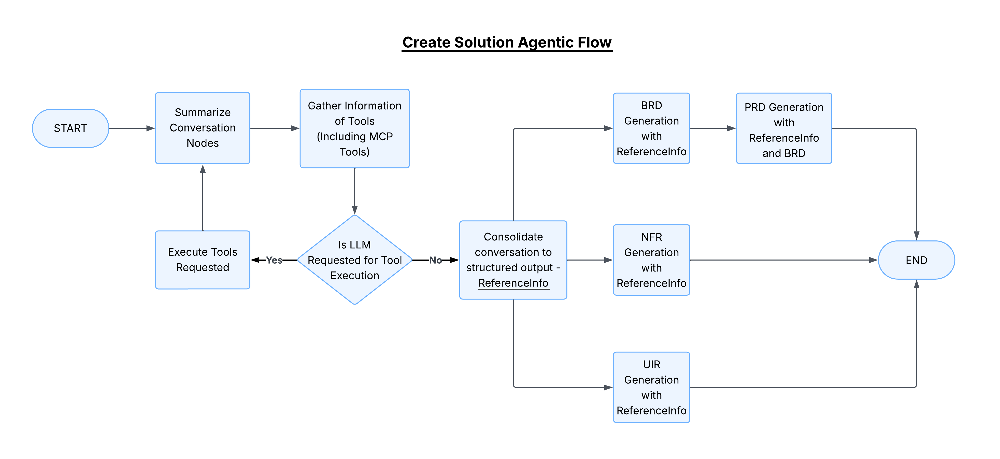

# Advanced Features of Specifai 🚀

Take your Specifai experience to the next level! This guide explores the powerful advanced capabilities that will transform your requirements management into a seamless, intelligent process.

## 🤖 Agentic Solution Requirement Generation



Experience the future of requirement generation with our Langgraph-powered agentic workflow! This intelligent system works tirelessly to create precise, comprehensive solution requirements.

### 🔄 Key Phases

1. **Context Gathering Phase**
   - **🎯 Summarisation**
     * Analyzes solution metadata
     * Processes conversation history
     * Creates concise context summaries
   
   - **📚 Context Gathering**
     * Integrates Knowledge-Base data
     * Pulls relevant enterprise information
     * Connects with MCP tools
   
   - **🤔 Decision Point**
     * Smart LLM tool execution
     * Adaptive processing
     * Intelligent routing
   
   - **📊 Data Consolidation**
     * Organizes into ReferenceInfo format
     * Structures information hierarchically
     * Prepares for requirement generation

2. **Requirement Generation Phase**
   Transform structured data into comprehensive documentation:
   ```mermaid
   graph TD
     A[Structured Data] --> B[BRD Generation]
     A --> C[PRD Creation]
     A --> D[NFR Development]
     A --> E[UIR Specification]
     B --> F[Final Documentation]
     C --> F
     D --> F
     E --> F
   ```

## 🎭 Multi-Model Support


Choose the perfect AI model for your needs:

### 🌟 Supported Models

1. **Azure OpenAI**
   ```json
   {
     "models": {
       "gpt-4o": "Best for complex requirements",
       "gpt-4o-mini": "Faster, cost-effective option"
     }
   }
   ```

2. **AWS Bedrock**
   - Latest Claude 3 Models:
     * Sonnet: Balanced performance
     * Opus: Highest capability
     * Haiku: Fast, efficient processing

3. **Gemini**
   - Pro Series Features:
     * Enhanced context understanding
     * Improved technical accuracy
     * Faster response times

4. **Additional Options**
   - OpenRouter: Model marketplace access
   - Ollama: Local model support

### 🎯 Smart Model Selection

Choose your model based on:
| Factor | Consideration |
|--------|---------------|
| Complexity | Task difficulty level |
| Speed | Response time needs |
| Cost | Budget constraints |
| Features | Special capabilities |

## 📊 Analytics & Observability

### Real-time Insights
- Performance metrics
- Usage patterns
- Error tracking
- Response analysis

### Integration Options
```python
# PostHog Analytics
analytics.track({
    'event': 'document_generated',
    'properties': {
        'type': 'BRD',
        'time_taken': '2.3s',
        'model_used': 'gpt-4o'
    }
})

# Langfuse Observability
trace = langfuse.trace({
    'name': 'requirement_generation',
    'metadata': {
        'solution_id': 'xyz-123',
        'complexity': 'high'
    }
})
```

## 🔗 BRD-PRD Linking


### Smart Linking Features
1. **Contextual Connections**
   - Automatic reference mapping
   - Requirement traceability matrix
   - Impact analysis dashboard

2. **Intelligent Updates**
   - Real-time synchronization
   - Version control integration
   - Change history tracking

### Best Practices


## 📝 Custom Templates

### Template Magic
1. **Creation & Management**
   ```json
   {
     "template_type": "BRD",
     "sections": [
       "Executive Summary",
       "Business Context",
       "Requirements",
       "Success Criteria"
     ],
     "variables": {
       "project_name": "${project}",
       "stakeholders": "${stakeholders}",
       "objectives": "${objectives}"
     }
   }
   ```

2. **Smart Usage**
   - One-click application
   - Bulk processing
   - Dynamic updates

## 📚 Version-Controlled Requirements

### Power Features
1. **Document Control**
   - Git-style versioning
   - Branch management
   - Merge workflows

2. **Collaboration Tools**
   - Real-time co-editing
   - Comment threads
   - Review system

### VCS Integration
```bash
# Example Git workflow
git checkout -b feature/new-requirement
# Make changes in Specifai
git add .
git commit -m "Add payment processing requirements"
git push origin feature/new-requirement
```

## 🏗 Architecture Overview


### System Components
1. **Modern Frontend**
   - Angular UI
   - Real-time updates
   - Responsive design

2. **Powerful Backend**
   - Electron core
   - RESTful APIs
   - File system management

3. **Flexible Integration**
   - MCP protocol support
   - External service connectors
   - Custom adapters

## ⚡ Performance Tips

### Optimization Strategies
1. **Document Management**
   ```javascript
   // Example cleanup configuration
   {
     "auto_cleanup": true,
     "retention_period": "90d",
     "index_optimization": "weekly"
   }
   ```

2. **Model Optimization**
   - Load balancing
   - Response caching
   - Fallback configuration

### Security Best Practices
1. **Access Management**
   - Role-based controls
   - API key rotation
   - Audit logging

2. **Data Protection**
   - At-rest encryption
   - TLS transmission
   - Automated backups

## 🎉 Next Steps

Ready to master these advanced features?

1. **Explore the Architecture**
   - Review system diagrams
   - Understand data flow
   - Learn integration points

2. **Optimize Your Setup**
   - Test different models
   - Configure analytics
   - Set up version control

3. **Enhance Security**
   - Implement best practices
   - Configure backups
   - Set up monitoring

Need help? Check our [Troubleshooting & FAQs](troubleshooting.md) guide or join our [Community Discussions](https://github.com/presidio-oss/specif-ai/discussions)!
