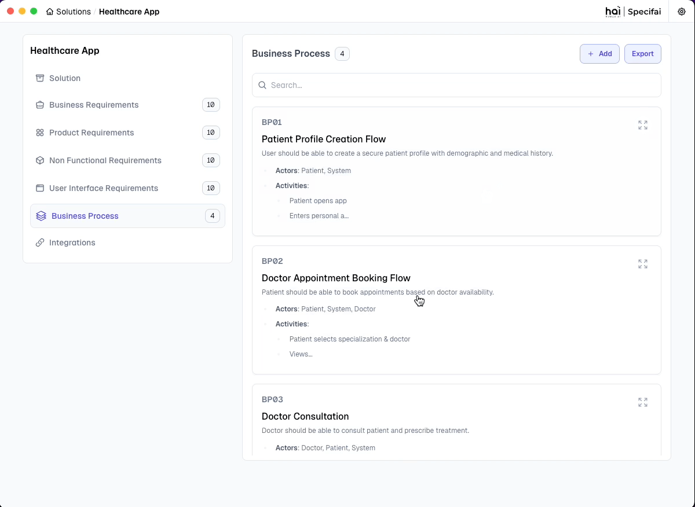
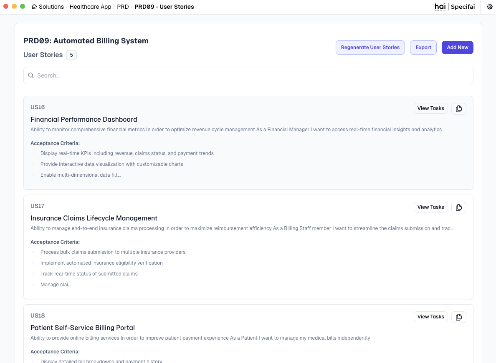

# Core Features of Specifai 🌟

Discover the powerful features that make Specifai your ultimate companion for SDLC process acceleration! This guide walks you through each major feature with practical examples and best practices.

## 📋 What's Inside

- Solution Creation and Management
- AI-Powered Document Generation
- Managing Requirements
- Business Process Visualization
- Intelligent Chat Interface
- User Stories & Tasks Generation
- Model Configuration
- Integration Capabilities

## 🎯 Solution Creation and Management

### Creating Your First Solution
<div align="center">

  
*Transform your ideas into well-structured solutions in minutes*

</div>

1.  **Launch Solution Creation**
    * Click the "**New Solution**" button on your dashboard.
    * > Pro tip: Keep the dashboard organized by using clear naming conventions.

2.  **Define Solution Details**
    * **Solution Name**: Choose a clear, descriptive name.
        * Good example: "Task-Management-System"
        * Avoid generic names like "New Project"
    * **Description**: Provide comprehensive context.
        * Include business objectives
        * Mention key stakeholders
        * Outline primary goals
        * Include third-party integrations
        * Include compliance requirements
    * **Technical Stack**: Specify your technology choices.
        * Frontend frameworks (e.g., React, Angular)
        * Backend technologies (e.g., Node.js, Java)
        * Databases (e.g., PostgreSQL, MongoDB)
        * Infrastructure (e.g., AWS, Azure)
    * **Is solution built already?**: Configure requirement generation preferences using the toggle.
        * When enabled, no requirements will be generated, giving users more control over requirement creation.
        * When disabled, Specifai starts fresh with new requirement generation based on the provided context.

3.  **Configure Solution Preferences**
    Set the minimum number of requirements (default: 15) to be generated for BRD, PRD, UIR, and NFR types. Adjust based on project scope.

4.  **MCP Integration Setup**
    Enhance your solution with Model Context Protocol servers:
    * **AWS Bedrock KB**
        * Connect to AWS Bedrock Knowledge Base
        * Leverage enterprise knowledge for better context
        * Enable advanced AI capabilities
    * **Custom MCP Server**
        * Add new MCP servers for extended functionality
        * Configure custom integrations
        * Access additional AI models and tools

5.  **Create Solution Space**
    * Click "**Create**" to initialize your solution with requirements and MCP configurations.
    * Watch as Specifai sets up your workspace with AI-powered intelligence.

### Understanding Solution Structure
Each solution follows a modular, scalable structure:

```
📁 Solution Root Folder
├── 📄 .metadata.json            # Solution configuration
├── 📁 BRD                       # Business Requirements
│   ├── 📄 BRD01-base.json
│   └── 📄 BRDxx-base.json
├── 📁 NFR                       # Non-Functional Requirements
│   ├── 📄 NFR01-base.json
│   └── 📄 NFRxx-base.json
├── 📁 PRD                       # Product Requirements
│   ├── 📄 PRD01-base.json
│   ├── 📄 PRD01-feature.json    # User Stories & Tasks
│   ├── 📄 PRDxx-base.json
│   └── 📄 PRDxx-feature.json
├── 📁 UIR                       # User Interface Requirements
│   ├── 📄 UIR01-base.json
│   └── 📄 UIRxx-base.json
└── 📁 BP                        # Business Process Flows
    ├── 📄 BP01-base.json
    └── 📄 BPxx-base.json
```

#### Key Components

1.  **🔖 Metadata Configuration (`.metadata.json`)**
    * Solution name and description
    * Technical stack details
    * Creation and modification timestamps
    * MCP Tools configuration

2.  **📑 Document Types**
    * **BRD**: Business objectives & stakeholder needs
    * **PRD**: Technical specs & implementation details
    * **User Stories**: Actionable items from PRD
    * **Tasks**: Breakdown of user stories
    * **NFR**: Performance & security requirements
    * **UIR**: UI/UX design guidelines

## 🤖 AI-Powered Document Generation

Specifai streamlines the creation of essential SDLC documents. Below are the key document types Specifai helps you generate and manage:

<div align="center">

  
*AI-powered document generation workflow*

</div>

1.  **Business Requirements (BRD)**

    #### What is a BRD?
    A Business Requirements Document (BRD) is a formal document that describes the business solution for a project, including the user's needs and expectations, the purpose and objectives of the product/solution, and any high-level constraints or dependencies. It serves as a bridge between business objectives and technical implementation, ensuring all stakeholders have a clear understanding of what needs to be achieved.

    #### Best Practices for Writing BRDs
    * Start with a clear business objective
    * Include stakeholder impact analysis
    * Define measurable success criteria
    * Specify regulatory/compliance requirements
    * Document assumptions and constraints
    * Include cost-benefit analysis
    * Reference related industry standards
    * Maintain traceability to business goals

    #### Example BRD
    ```markdown
    Title: Implement Multi-Factor Authentication System

    Business Need:
    To enhance security and comply with industry regulations, we need to implement a robust multi-factor authentication system that reduces unauthorized access attempts while maintaining user convenience.

    Key Objectives:
    - Reduce security incidents by 75%
    - Achieve compliance with GDPR and PSD2 requirements
    - Minimize user friction during authentication

    Success Criteria:
    - 99.9% system availability
    - <30 seconds authentication completion time
    - 50% reduction in password reset requests
    ```

    <div align="center">

      
    *Business Requirements Document interface in Specifai*

    </div>

2.  **Product Requirements (PRD)**

    #### What is a PRD?
    A Product Requirements Document (PRD) is a technical document that outlines the specific requirements, features, and functionalities of a product or system. It translates business requirements into detailed technical specifications that guide development teams in implementing the solution effectively. **PRDs can be linked to relevant BRDs** to ensure alignment between business needs and technical implementation.

    #### Best Practices for Writing PRDs
    * Define system interfaces and integration points
    * Specify data models and state transitions
    * Document error scenarios and recovery paths
    * Include performance SLAs and scalability targets

    #### Example PRD
    ```markdown
    Title: JWT-Based Authentication System Implementation

    Technical Scope:
    Implement a secure authentication system using JWT tokens with refresh mechanism and 2FA support.

    Technical Requirements:
    - JWT token-based authentication with RSA-256 encryption
    - Secure refresh token mechanism with 7-day expiry
    - Two-factor authentication via SMS/email
    - Password policy enforcement (min 12 chars, special chars, etc.)

    Performance Requirements:
    - Handle 1000 concurrent login requests
    - Authentication response time < 500ms
    - 99.99% uptime for auth services

    Security Measures:
    - Rate limiting: 5 attempts per minute
    - Token blacklisting for compromised sessions
    - OWASP compliance for all endpoints
    ```
    <div align="center">

    
    *Product Requirements Document interface in Specifai*

    </div>

3.  **User Stories (US)**

    #### What are User Stories?
    User Stories are concise descriptions of functionality from an end user's perspective. They capture what users want to achieve, why they want it, and what value it brings to them. User stories help teams understand the user's needs and expectations.

    #### Best Practices for Writing User Stories
    * Link to specific business capabilities
    * Include technical dependencies and constraints
    * Define clear validation criteria
    * Specify data requirements and state changes
    * **Story Format**:
        ```
        As a [user type]
        I want to [action]
        So that [benefit]
        ```

    #### Example User Story
    ```markdown
    Title: Biometric Authentication for Mobile Users

    User Story:
    As a mobile user,
    I want to use biometric authentication
    So that I can securely access my account without typing passwords

    Acceptance Criteria:
    - Support fingerprint and face recognition
    - Fallback to password if biometric fails
    - Work offline after initial setup
    - Complete auth within 3 seconds

    Priority: High
    Effort: Medium
    Dependencies: Authentication System PRD
    ```
    <div align="center">

    
    *User Story details interface in Specifai*

    </div>

4.  **Tasks**

    #### What are Tasks?
    Tasks are specific, actionable items that break down the implementation of user stories into manageable pieces of work. They represent the technical steps needed to deliver the functionality described in user stories.

    #### Best Practices for Writing Tasks
    * Define technical acceptance criteria
    * Specify test scenarios and edge cases
    * Document system dependencies
    * Include rollback procedures

    #### Example Task
    ```markdown
    Task Name: Implement Password Policy Validation Service

    Description:
    Create password validation service in Node.js to enforce complexity requirements.

    Acceptance Criteria:
    - Validate minimum password length of 8 characters
    - Require at least one uppercase letter
    - Require at least one lowercase letter
    - Require at least one number
    - Require at least one special character
    - Return detailed validation error messages

    Suggestions to improve:
    - Add biometric login fallback
    - Enable password strength visualization
    - Integrate breach database check
    ```
    > **Note:** Use the Chat AI interface to modify requirements as needed.

    <div align="center">

    
    *Task details interface in Specifai*

    </div>

5.  **Non-Functional Requirements (NFR)**

    #### What are NFRs?
    Non-Functional Requirements define the quality attributes and operational characteristics of a system. Unlike functional requirements that specify what the system should do, NFRs describe how the system should perform, focusing on criteria that can be used to judge the system's operation rather than specific behaviors.

    #### Best Practices for Writing NFRs
    * Define quantifiable metrics for each requirement
    * Specify monitoring and alerting thresholds
    * Document compliance validation methods
    * Include performance test scenarios

    #### Example NFR
    ```markdown
    Title: System Performance and Reliability Requirements

    Performance Criteria:
    - Response Time: < 200ms for 95% of requests
    - Throughput: 1000 transactions per second
    - Concurrent Users: Support 10,000 active sessions

    Security Requirements:
    - Data Encryption: AES-256 for data at rest
    - Access Control: Role-based with MFA
    - Audit Logging: All system access events
    - Compliance: SOC2, GDPR, HIPAA

    Operational Standards:
    - Availability: 99.99% uptime
    - Backup: Hourly incremental, daily full
    - Recovery Time: < 4 hours
    - Data Retention: 7 years
    ```
    <div align="center">

    
    *Non-Functional Requirements interface in Specifai*

    </div>

6.  **User Interface Requirements (UIR)**

    #### What are UIRs?
    User Interface Requirements define the visual, interactive, and experiential aspects of a system's user interface. They ensure consistency in design, optimal user experience, and adherence to brand guidelines while maintaining accessibility and usability standards.

    #### Best Practices for Writing UIRs
    * Define component-specific accessibility requirements
    * Document responsive breakpoints and behaviors
    * Specify interaction states and transitions
    * Include performance metrics for UI components

    #### Example UIR
    ```markdown
    Title: Authentication Interface Requirements

    Design System:
    - Color Palette: Primary (#007AFF), Secondary (#6C757D)
    - Typography: Roboto for headings, Open Sans for body
    - Components: Material Design v3 specifications
    - Spacing: 8px base unit grid system

    Interface Elements:
    - Login Form:
      * Centered card layout (max-width: 400px)
      * Input fields with floating labels
      * Password visibility toggle
      * Remember me checkbox
      * Social login options grid

    Responsive Behavior:
    - Mobile: Single column, full-width inputs
    - Tablet: 70% width container
    - Desktop: Fixed width card (400px)

    Accessibility:
    - WCAG 2.1 AA compliance
    - Keyboard navigation support
    - Screen reader optimization
    - High contrast mode support
    ```
    <div align="center">

    
    *User Interface Requirements interface in Specifai*

    </div>

## 📊 Business Process Visualization

### What is a Business Process Flow?

A Business Process Flow (BP Flow) is a visual representation of the steps, decisions, and interactions involved in a business process. It helps teams understand the workflow, identify bottlenecks, and optimize processes for efficiency.

### Benefits of BP Flows
* **Clarity**: Provides a clear overview of complex processes.
* **Collaboration**: Facilitates discussions among stakeholders.
* **Optimization**: Identifies inefficiencies and areas for improvement.
* **Documentation**: Serves as a reference for process standards and compliance.

<div align="center">

  
*Business process flow visualization in action within Specifai*

</div>

### How to Create and Manage BP Flows

1.  **Basic Information**
    * Enter a descriptive title.
    * Provide detailed process description.
    * Link relevant BRDs and PRDs for context.
    <div align="center">

      
    *Business process flow configuration interface*

    </div>

2.  **Automatic Flow Generation**
    * AI-powered flow diagram generation.
    * Intelligent process analysis based on the linked requirements and BP context.
    <div align="center">

      
    *AI-powered flow diagram generation in action*

    </div>

3.  **Flow Management**
    * View generated process flows.
    * Download flow diagrams.
    * Regenerate flows as needed.

### Best Practices for BP Flows
* **Input Quality**:
    * Use clear, detailed descriptions including actors involved and activities performed.
    * Link all relevant BRDs & PRDs.
    * Ensure to provide comprehensive business flow context.


## ✍️ Managing Requirements

Once your initial documents are generated, Specifai provides robust tools to manage and refine your requirements throughout the SDLC.

1.  **Adding Requirements**
    * Fill in Basic Details:
        * **Title**: Write a clear, descriptive title that reflects the requirement's purpose.
        * **Description**: Provide comprehensive details about functionality, constraints, and goals.
        * **Code References**: Upload relevant code files to provide implementation context.
    * Enhance with AI:
        * Click the "**Enhance with AI**" button to improve requirement quality.
        * Review AI-generated suggestions for title and description.
        * Requirements are automatically saved when enhanced.
    <div align="center">

      
    *Interface for adding or enhancing a requirement (e.g., a BRD)*

    </div>

2.  **Updating Requirements**
    * Select and Modify:
        * Click any requirement to open it for editing.
        * Update title and description as needed.
        * Changes are auto-saved while typing.
    * AI Enhancement:
        * Use "**Enhance with AI**" to improve existing content.
        * Review and apply AI suggestions as needed from the AI Chat Interface on the right side of the screen.
    <div align="center">

      
    *Updating a requirement with AI assistance*

    </div>
    > 💡 **Pro Tip:** Use the AI chat interface for real-time suggestions and improvements when updating requirements.
    <div align="center">

    
    *The AI Chat Interface assisting with requirement updates*

    </div>

3.  **Deleting Requirements**
    * Remove Requirements:
        * Click the "**Delete**" button on any requirement.
        * Confirm deletion in the verification dialog.
        * Requirements are soft-deleted for safety.
    * Archival System:
        * Deleted requirements are stored in the HAI Solution Folder.
        * Full history and relationships are preserved.
        * Recover deleted requirements when needed.


## 💬 Intelligent Chat Interface

The Intelligent Chat Interface in Specifai is more than just a chatbot—it's your on-demand SDLC assistant. Designed to understand natural language queries and context-aware prompts, it enables seamless collaboration and dynamic requirement refinement.

<div align="center">

  
*AI-powered chat interface for real-time assistance*

</div>

### Key Capabilities

1.  **Natural Language Understanding**
    * Ask questions like:
        *“Can you refine the BRD for authentication based on SSO?”*
        *“Add NFR data privacy guidelines”*
        *“What are the UI constraints for the login module?”*
    * The chat interprets intent and context to perform relevant actions.

2.  **Smart Suggestions**
    * Recommends improvements, clarifies ambiguities, and proposes industry best practices.
    * Detects vague or incomplete inputs and prompts for clarification to improve requirement quality.

3.  **Context-Aware Actions**
    * Uses solution metadata and linked document context to tailor responses and suggestions.

4.  **Seamless Collaboration**
    * Collaborate across teams with a shared chat interface.
    * Great for onboarding new team members and aligning stakeholder understanding.

## 📝 User Stories & Tasks Generation

This feature enables the seamless generation of user stories and associated tasks from a selected Product Requirement Document (PRD). It leverages an intelligent **Agentic Flow** that interprets the provided context to produce meaningful and actionable development items.

<div align="center">

  
*AI-powered user story generation in action*

</div>

### 🔹 How It Works

1.  **Select a PRD:**
    Begin by selecting the relevant PRD from the available list.

2.  **Click on 'Generate Stories':**
    Once the PRD is selected, click the **Generate Stories** button.

3.  **Provide Context in the Popup:**
    A popup window will appear, prompting you to gather additional context or clarification to guide the generation process.

4.  **User Story & Task Generation:**
    Upon submission, the backend **Agentic Flow** is triggered. It performs two key actions:
    * Generates **User Stories** based on the selected PRD and the provided context.
    * If MCP servers are configured (like AWS Bedrock Knowledge Base), the Agentic flow utilizes them to enhance the context and improve the quality of generated stories.
    * Automatically invokes the **Generate Tasks** workflow for each generated story, creating well-defined tasks under each story.

### 🔄 Regeneration Support

Users can regenerate user stories and tasks at any time. When this action is triggered:

<div align="center">

  
*Story regeneration interface with archival support*

</div>

* All **previously generated user stories and tasks** are **archived automatically**.
* A **new set of user stories and tasks** is created based on the latest context and PRD selection.

This ensures that the system always reflects the most current understanding of requirements while maintaining historical traceability.

### ✅ Output

* A structured list of **User Stories**, each containing:
    * Title
    * Description
    * Acceptance Criteria
* An associated list of **Tasks** for each story, including:
    * Task Title
    * Description
    * Acceptance Criteria

### Export Options

Specifai provides three key export options to seamlessly share and integrate the requirements (BRD, PRD, UIR, NFR and user stories) with all the stakeholders and development teams:

1.  **Copy to Clipboard (JSON)**
    * Export requirements in JSON format.
    * Preserves complete structure and relationships.
    * Ideal for developers and technical teams.

2.  **Excel Export**
    * Download requirements as structured spreadsheets.
    * Includes all requirement details and metadata.
    * Perfect for stakeholder review and documentation.

3.  **Jira Sync** (Individual PRD - User Stories level)
    * Direct synchronization with Jira projects.
    * Automatically creates epics, stories, and tasks.
    * Maintains hierarchy and relationships.

<div align="center">

  
*Export interface for requirements and user stories*

</div>

## ⚙️ Model Configuration

Choose the AI model that best suits your needs from a variety of providers. Specifai supports:
* **Azure OpenAI**
    * gpt-4o
    * gpt-4o-mini
* **OpenAI Native**
    * gpt-4o
    * gpt-4o-mini
* **AWS Bedrock**
    * anthropic.claude-3-7-sonnet-20250219-v1:0
    * anthropic.claude-3-5-sonnet-20241022-v2:0
    * anthropic.claude-3-5-haiku-20241022-v1:0
    * anthropic.claude-3-5-sonnet-20240620-v1:0
    * anthropic.claude-3-opus-20240229-v1:0
    * anthropic.claude-3-sonnet-20240229-v1:0
    * anthropic.claude-3-haiku-20240307-v1:0
* **Gemini**
    * gemini-2.0-flash-001
    * gemini-2.0-flash-lite-preview-02-05
    * gemini-2.0-pro-exp-02-05
    * gemini-2.0-flash-thinking-exp-01-21
    * gemini-2.0-flash-thinking-exp-1219
    * gemini-2.0-flash-exp
    * gemini-1.5-flash-002
    * gemini-1.5-flash-exp-0827
    * gemini-1.5-flash-8b-exp-0827
    * gemini-1.5-pro-002
    * gemini-1.5-pro-exp-0827
    * gemini-exp-1206
* **OpenRouter**
* **Ollama**

<div align="center">

  
*Easily configurable multi-provider AI model support*

</div>

## 🔄 Integration Capabilities

Specifai seamlessly integrates with your existing tools to enhance your workflow:

1.  **Jira Integration**
    * Automatic story creation from PRDs.
    * Task synchronization.
    * Status updates.
    * [Learn more about Jira setup](integrations-setup.md#jira-integration)

2.  **AWS Bedrock Integration**
    * Knowledge base connection for richer context.
    * Enhanced AI capabilities for document generation and refinement.
    * [Configure AWS Bedrock](aws-bedrock-kb-configuration.md)

3.  **Custom MCP Servers**
    * Extended functionality via Model Context Protocol.
    * Custom tool and AI model integration.
    * [Set up MCP servers](integrations-setup.md#mcp-configuration)

## 🎉 Next Steps

Ready to explore more with Specifai?
1.  Set up [integrations](integrations-setup.md) with your existing tools.
2.  Discover [advanced features](advanced-features.md) for power users.
3.  Join our [community](https://github.com/presidio-oss/specif-ai/discussions) to ask questions and share feedback.

Need help? Check our [troubleshooting guide](troubleshooting.md) or reach out to [support](mailto:hai-feedback@presidio.com).

Remember: Specifai is continuously evolving - check our [release notes](https://github.com/presidio-oss/specif-ai/releases) for the latest features and improvements!
