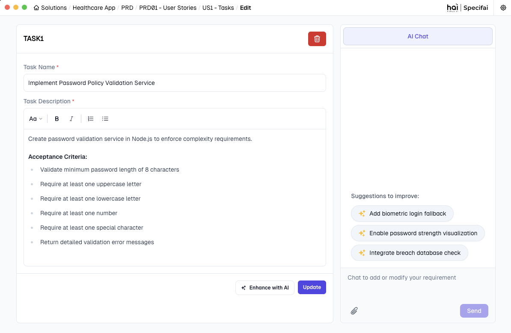

# Core Features of Specifai 🌟

Discover the powerful features that make Specifai your ultimate companion for SDLC process acceleration! This guide walks you through each major feature with practical examples and best practices.

## 📋 What's Inside

- Solution Creation and Management
- AI-Powered Document Generation
- Intelligent Chat Interface
- Business Process Visualization
- User Stories & Tasks Generation
- Model Configuration

## 🎯 Solution Creation and Management

### Creating Your First Solution

Transform your ideas into well-structured solutions in minutes:

1. **Launch Solution Creation**
   - Click the "New Solution" button on your dashboard
   - Pro tip: Keep the dashboard organized by using clear naming conventions

2. **Define Solution Details**
   - **Solution Name**: Choose a clear, descriptive name
     * Good example: "Task-Management-System"
     * Avoid generic names like "New Project"
   
   - **Description**: Provide comprehensive context
     * Include business objectives
     * Mention key stakeholders
     * Outline primary goals
     * Include third-party integrations
     * Include compliance requirements
   
   - **Technical Stack**: Specify your technology choices
     * Frontend frameworks (e.g., React, Angular)
     * Backend technologies (e.g., Node.js, Java)
     * Databases (e.g., PostgreSQL, MongoDB)
     * Infrastructure (e.g., AWS, Azure)

   - **Solution Context**: Configure solution preferences
     * Toggle "Is solution built already?" for existing solutions
     * When enabled, no requirements will be generated which gives users more control over requirement creation.
     * When disabled, starts fresh with new requirement generation based on the provided context.

3. **Configure Solution Preferences**
   Set minimum requirements and optimize your project settings:

   - **Requirements Configuration**
     * Business Requirements (BRD): Set minimum count (default: 15)
     * Product Requirements (PRD): Set minimum count (default: 15)
     * UI Requirements (UIR): Set minimum count (default: 15)
     * Non-Functional Requirements (NFR): Set minimum count (default: 15)

   > 💡 **Pro Tip**: Adjust requirement counts based on your project's scope and complexity.

4. **MCP Integration Setup**
   Enhance your solution with Model Context Protocol servers:

   - **AWS Bedrock KB**
     * Connect to AWS Bedrock Knowledge Base
     * Leverage enterprise knowledge for better context
     * Enable advanced AI capabilities

   - **Custom MCP Server**
     * Add new MCP servers for extended functionality
     * Configure custom integrations
     * Access additional AI models and tools

5. create Solution Space
   - Click "Create" to create your solution with requirements and mcp configurations.
   - Watch as Specifai sets up your workspace with AI-powered intelligence


### Understanding Solution Structure
Each solution follows a modular, scalable structure:

```
📁 Solution Root Folder
├── 📄 .metadata.json          # Solution configuration
├── 📁 BRD                     # Business Requirements
│   ├── 📄 BRD01-base.json        
│   └── 📄 BRDxx-base.json    
├── 📁 NFR                     # Non-Functional Requirements
│   ├── 📄 NFR01-base.json        
│   └── 📄 NFRxx-base.json  
├── 📁 PRD                     # Product Requirements
│   ├── 📄 PRD01-base.json  
│   ├── 📄 PRD01-feature.json     # User Stories & Tasks
│   ├── 📄 PRDxx-base.json  
│   └── 📄 PRDxx-feature.json
└── 📁 UIR                     # User Interface Requirements
    ├── 📄 UIR01-base.json        
    └── 📄 UIRxx-base.json  
```

#### Key Components

1. **🔖 Metadata Configuration** (.metadata.json)
   - Solution name and description
   - Technical stack details
   - Creation and modification timestamps
   - MCP Tools configuration

2. **📑 Document Types**
   - **BRD**: Business objectives and stakeholder needs
   - **PRD**: Technical specifications and implementation details
   - **User Stories**: Actionable user stories derived from PRD
   - **Tasks**: User Stories broken down into manageable tasks
   - **UIR**: User interface design and interaction guidelines
   - **NFR**: Performance, security, and operational requirements
   - **UIR**: Design guidelines and user interaction flows


## 🤖 AI-Powered Document Generation


1. **Business Requirements (BRD)**
   
   #### What is a BRD?
   A Business Requirements Document (BRD) is a formal document that describes the business solution for a project, including the user's needs and expectations, the purpose and objectives of the product/solution, and any high-level constraints or dependencies. It serves as a bridge between business objectives and technical implementation, ensuring all stakeholders have a clear understanding of what needs to be achieved.

   #### Best Practices for Writing BRDs
   - Start with a clear business objective
   - Include stakeholder impact analysis
   - Define measurable success criteria
   - Specify regulatory/compliance requirements
   - Document assumptions and constraints
   - Include cost-benefit analysis
   - Reference related industry standards
   - Maintain traceability to business goals

   #### Example BRD
   ```markdown
   Title: Implement Multi-Factor Authentication System

   Business Need:
   To enhance security and comply with industry regulations, we need to implement a robust multi-factor authentication system that reduces unauthorized access attempts while maintaining user convenience.

   Key Objectives:
   - Reduce security incidents by 75%
   - Achieve compliance with GDPR and PSD2 requirements
   - Minimize user friction during authentication

   Success Criteria:
   - 99.9% system availability
   - <30 seconds authentication completion time
   - 50% reduction in password reset requests
   ```

   

2. **Product Requirements (PRD)**

   #### What is a PRD?
   A Product Requirements Document (PRD) is a technical document that outlines the specific requirements, features, and functionalities of a product or system. It translates business requirements into detailed technical specifications that guide development teams in implementing the solution effectively. 

   Also, PRDs can be linked to relevant BRDs to ensure alignment between business needs and technical implementation.

   #### Best Practices for Writing PRDs
   - Detail technical implementation approaches
   - List system dependencies and integrations
   - Specify performance requirements
   - Document API specifications
   - Include error handling scenarios
   - Define data models and flows
   - Outline security requirements
   - Specify testing criteria

   #### Example PRD
   ```markdown
   Title: JWT-Based Authentication System Implementation

   Technical Scope:
   Implement a secure authentication system using JWT tokens with refresh mechanism and 2FA support.

   Technical Requirements:
   - JWT token-based authentication with RSA-256 encryption
   - Secure refresh token mechanism with 7-day expiry
   - Two-factor authentication via SMS/email
   - Password policy enforcement (min 12 chars, special chars, etc.)

   Performance Requirements:
   - Handle 1000 concurrent login requests
   - Authentication response time < 500ms
   - 99.99% uptime for auth services

   Security Measures:
   - Rate limiting: 5 attempts per minute
   - Token blacklisting for compromised sessions
   - OWASP compliance for all endpoints
   ```

   

3. **User Stories (US)**

   #### What are User Stories?
   User Stories are concise descriptions of functionality from an end user's perspective. They capture what users want to achieve, why they want it, and what value it brings to them. User stories help teams understand the user's needs and expectations.

   #### Best Practices for Writing User Stories
   - Follow the "As a/I want/So that" format
   - Focus on user value and benefits
   - Keep scope manageable and specific
   - Include clear acceptance criteria
   - Link to relevant PRDs
   - Prioritize based on business value
   - Add effort estimation
   - Include dependencies

   #### Example User Story
   ```markdown
   Title: Biometric Authentication for Mobile Users

   User Story:
   As a mobile user,
   I want to use biometric authentication
   So that I can securely access my account without typing passwords

   Acceptance Criteria:
   - Support fingerprint and face recognition
   - Fallback to password if biometric fails
   - Work offline after initial setup
   - Complete auth within 3 seconds

   Priority: High
   Effort: Medium
   Dependencies: Authentication System PRD
   ```

   

4. **Tasks**

   #### What are Tasks?
   Tasks are specific, actionable items that break down the implementation of user stories into manageable pieces of work. They represent the technical steps needed to deliver the functionality described in user stories.

   #### Best Practices for Writing Tasks
   - Make tasks specific and actionable
   - Keep scope small and focused
   - Include technical details
   - Set clear completion criteria
   - Estimate effort accurately
   - Identify dependencies
   - Consider testing requirements
   - Document technical constraints

   #### Example Tasks
   ```markdown
   Parent User Story: Biometric Authentication for Mobile Users

   Tasks:
   1. Implement Biometric API Integration
      Description: Set up and configure biometric authentication system
      Steps:
      - Research available biometric libraries
      - Set up device compatibility checks
      - Implement fingerprint reader interface
      - Add face recognition support
      Effort: 3 days
      Dependencies: None

   2. Secure Storage Implementation
      Description: Create secure storage for biometric data
      Steps:
      - Design encryption mechanism
      - Implement secure key storage
      - Add data privacy compliance checks
      - Set up secure backup system
      Effort: 2 days
      Dependencies: Task 1

   3. Fallback Mechanism
      Description: Implement password fallback system
      Steps:
      - Design password fallback flow
      - Implement attempt tracking
      - Add user notifications
      - Create recovery process
      Effort: 2 days
      Dependencies: Task 2
   ```

   

5. **Non-Functional Requirements (NFR)**

   #### What are NFRs?
   Non-Functional Requirements define the quality attributes and operational characteristics of a system. Unlike functional requirements that specify what the system should do, NFRs describe how the system should perform, focusing on criteria that can be used to judge the system's operation rather than specific behaviors.

   #### Best Practices for Writing NFRs
   - Make requirements measurable
   - Set clear acceptance criteria
   - Consider system constraints
   - Define monitoring metrics
   - Include compliance standards
   - Specify environmental conditions
   - Document dependencies
   - Address scalability needs

   #### Example NFR
   ```markdown
   Title: System Performance and Reliability Requirements

   Performance Criteria:
   - Response Time: < 200ms for 95% of requests
   - Throughput: 1000 transactions per second
   - Concurrent Users: Support 10,000 active sessions

   Security Requirements:
   - Data Encryption: AES-256 for data at rest
   - Access Control: Role-based with MFA
   - Audit Logging: All system access events
   - Compliance: SOC2, GDPR, HIPAA

   Operational Standards:
   - Availability: 99.99% uptime
   - Backup: Hourly incremental, daily full
   - Recovery Time: < 4 hours
   - Data Retention: 7 years
   ```

   

6. **User Interface Requirements (UIR)**

   #### What are UIRs?
   User Interface Requirements define the visual, interactive, and experiential aspects of a system's user interface. They ensure consistency in design, optimal user experience, and adherence to brand guidelines while maintaining accessibility and usability standards.

   #### Best Practices for Writing UIRs
   - Define clear design system rules
   - Specify accessibility standards
   - Document responsive behaviors
   - Include interaction patterns
   - Set performance benchmarks
   - Maintain brand consistency
   - Consider user preferences
   - Plan for localization

   #### Example UIR
   ```markdown
   Title: Authentication Interface Requirements

   Design System:
   - Color Palette: Primary (#007AFF), Secondary (#6C757D)
   - Typography: Roboto for headings, Open Sans for body
   - Components: Material Design v3 specifications
   - Spacing: 8px base unit grid system

   Interface Elements:
   - Login Form:
     * Centered card layout (max-width: 400px)
     * Input fields with floating labels
     * Password visibility toggle
     * Remember me checkbox
     * Social login options grid

   Responsive Behavior:
   - Mobile: Single column, full-width inputs
   - Tablet: 70% width container
   - Desktop: Fixed width card (400px)

   Accessibility:
   - WCAG 2.1 AA compliance
   - Keyboard navigation support
   - Screen reader optimization
   - High contrast mode support
   ```

   

### Managing Requirements

1. **Adding Requirements**
   - Fill in Basic Details
     * Title
     * Description
     * Upload Code Files References (if needed to construct the requirement from code)
   
   - Enhance with AI
     * Click "Enhance with AI" button
     * Enhance the requirement with AI-generated title and description. It will automatically save the requirement.
     * [Screenshot: specifai-brd-details.png]

2. **Updating Requirements**
   - Click on any requirement
   - Modify title, description
   - Use the "Enhance with AI" button to enhance the requirement.
   - Save changes to keep your requirements up-to-date

>Pro Tip: Use the AI chat interface to get real-time suggestions and improvements for your requirements.


3. **Deleting Requirements**
   - Click "Delete" on any requirement
   - Confirm deletion to remove the requirement from the solution. 
   - The requirement is soft deleted and archived in the HAI Solution Folder for future reference.


## 💬 Intelligent Chat Interface


Leverage our AI-powered chat for smarter requirement refinement:

### Real-time Enhancement Features
1. **Quick Access**
   - Click the chat icon in any document
   - Start with "Hello Specifai"

2. **Smart Commands**
   ```
   enhance [section]           # Improve specific sections
   add examples to [requirement]   # Add practical examples
   suggest improvements for [feature]   # Get AI recommendations
   generate test cases for [functionality]   # Create test scenarios
   ```

3. **Context-Aware Suggestions**
   - Industry best practices
   - Technical recommendations
   - Compliance considerations
   - Performance optimizations

## 📊 Business Process Visualization


Create clear, actionable process flows:

1. **Process Creation**
   - Navigate to "Business Processes"
   - Click "New Process Flow"
   - Choose from templates or start fresh

2. **Define Elements**
   - Start/End points
   - Activities and tasks
   - Decision points
   - Swim lanes for roles

3. **Enhance Details**
   - Process descriptions
   - Role assignments
   - Time estimates
   - Dependencies

## 📝 User Stories & Tasks


Transform requirements into actionable items:

### Story Generation
1. **Access Generator**
   - Navigate to "User Stories"
   - Click "Generate Stories"

2. **AI Analysis**
   - Requirements parsing
   - Story identification
   - Task breakdown
   - Effort estimation

3. **Review & Refine**
   - Validate stories
   - Adjust priorities
   - Add acceptance criteria
   - Link to requirements

### Best Practices
1. **Story Format**
   ```
   As a [user type]
   I want to [action]
   So that [benefit]
   ```

2. **Task Organization**
   - Clear hierarchy
   - Logical grouping
   - Priority levels
   - Sprint assignment

## ⚙️ Model Configuration


Optimize Specifai's AI capabilities:

### Available Models

1. **Azure OpenAI**
   ```json
   {
     "model": "gpt-4o",
     "temperature": 0.7,
     "max_tokens": 2000
   }
   ```

2. **AWS Bedrock**
   ```json
   {
     "model": "anthropic.claude-3-sonnet",
     "temperature": 0.8,
     "max_tokens": 2500
   }
   ```

3. **Gemini**
   ```json
   {
     "model": "gemini-2.0-pro",
     "temperature": 0.6,
     "max_tokens": 1800
   }
   ```

> 💡 **Note**: For detailed model options and advanced configurations, see our [Advanced Features Guide](advanced-features.md#model-configuration).

## 🔄 Integration Capabilities

Specifai seamlessly integrates with your existing tools:

1. **Jira Integration**
   - Automatic story creation
   - Task synchronization
   - Status updates
   - [Learn more about Jira setup](integrations-setup.md#jira-integration)

2. **AWS Bedrock Integration**
   - Knowledge base connection
   - Enhanced AI capabilities
   - [Configure AWS Bedrock](aws-bedrock-kb-configuration.md)

3. **Custom MCP Servers**
   - Extended functionality
   - Custom tool integration
   - [Set up MCP servers](integrations-setup.md#mcp-configuration)

## 🎉 Next Steps

Ready to explore more?
1. Set up [integrations](integrations-setup.md) with your existing tools
2. Discover [advanced features](advanced-features.md) for power users
3. Join our [community](https://github.com/presidio-oss/specif-ai/discussions)

Need help? Check our [troubleshooting guide](troubleshooting.md) or reach out to [support](mailto:hai-feedback@presidio.com).

Remember: Specifai is continuously evolving - check our [release notes](https://github.com/presidio-oss/specif-ai/releases) for the latest features and improvements!
