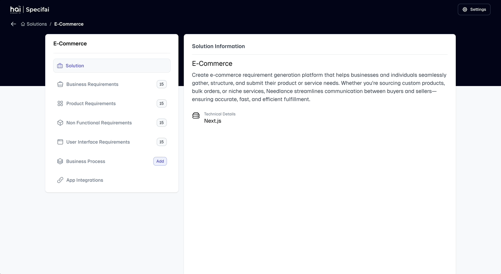
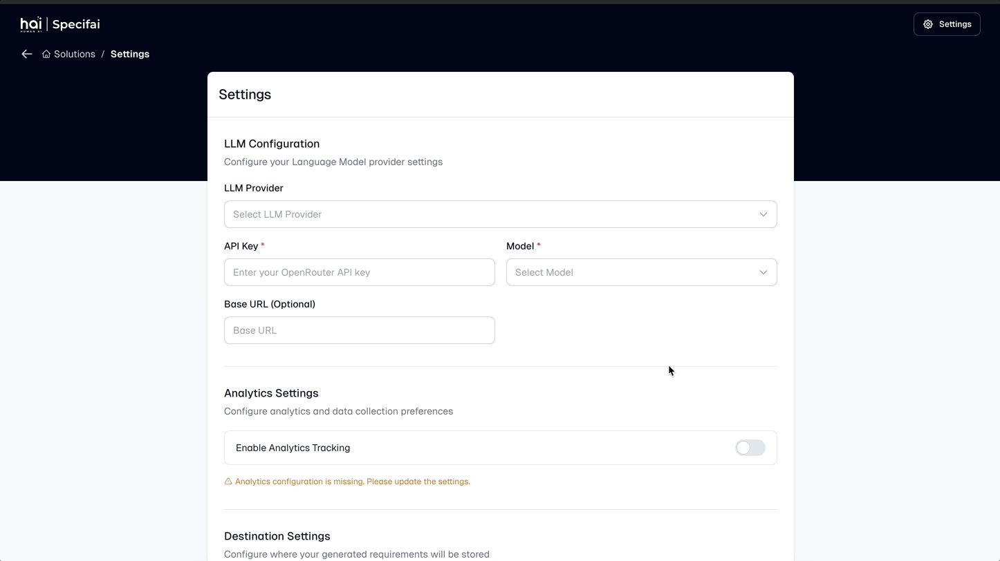

# Core Features of Specifai 🌟

Discover the powerful features that make Specifai your ultimate companion for SDLC process acceleration! This guide walks you through each major feature with practical examples and best practices.

## 🎯 Solution Creation and Management

### Creating Your First Solution


Transform your ideas into well-structured solutions in minutes:

1. **Launch Solution Creation**
   - Click the "New Solution" button on your dashboard
   - Pro tip: Keep the dashboard organized by using clear naming conventions

2. **Define Solution Details**
   - **Solution Name**: Choose a clear, descriptive name
     * Good example: "Customer-Portal-Modernization"
     * Avoid generic names like "New Project"
   
   - **Description**: Provide comprehensive context
     * Include business objectives
     * Mention key stakeholders
     * Outline primary goals
     * This information is stored in .metadata.json
     
   - **Technical Stack**: Specify your technology choices
     * Frontend frameworks (e.g., React, Angular)
     * Backend technologies (e.g., Node.js, Java)
     * Databases (e.g., PostgreSQL, MongoDB)
     * Infrastructure (e.g., AWS, Azure)

3. **Generate Solution Space**
   - Click "Create" to initialize your solution
   - Specifai creates the following structure:
     ```
     Active Solutions/
     ├── .metadata.json           # Solution configuration
     ├── BRD/                     # Business Requirements
     │   ├── BRD01-base.json     # Initial requirements
     │   └── ...                 # Additional BRDs
     ├── NFR/                     # Non-Functional Requirements
     ├── PRD/                     # Product Requirements
     └── UIR/                     # User Interface Requirements
     ```
   - Watch as Specifai sets up your workspace with AI-powered intelligence

## 🤖 AI-Powered Document Generation

### Business Requirement Documents (BRD)


Create comprehensive BRDs that stakeholders will love:

1. **Access BRD Generation**
   - Navigate to your solution
   - Select "Generate BRD"

2. **Define Business Context**
   - Industry vertical
   - Target audience
   - Market positioning
   - Business objectives

3. **Specify Requirements**
   - Business processes
   - Stakeholder needs
   - Success criteria
   - ROI expectations

### Product Requirement Documents (PRD)

Transform business requirements into technical specifications:

1. **Initialize PRD Creation**
   - Click "Generate PRD"
   - Link to existing BRD for context

2. **Technical Specifications**
   - Feature breakdown
   - System architecture
   - Data models
   - API specifications

3. **Implementation Details**
   - Development phases
   - Technical dependencies
   - Integration points
   - Performance criteria

### Non-Functional Requirements (NFR)

Ensure your solution meets quality standards:

1. **Performance Requirements**
   - Response time targets
   - Throughput expectations
   - Scalability needs
   - Resource utilization

2. **Security Specifications**
   - Authentication methods
   - Authorization levels
   - Data protection
   - Compliance requirements

3. **Operational Requirements**
   - Availability targets
   - Backup strategies
   - Monitoring needs
   - Disaster recovery

### User Interface Requirements (UIR)

Create engaging user experiences:

1. **Design Guidelines**
   - Brand compliance
   - Color schemes
   - Typography
   - Component library

2. **User Interaction Flows**
   - Navigation patterns
   - Input handling
   - Error management
   - Responsive design

## 💬 AI Chat Interface


Leverage our intelligent chat interface for requirement refinement:

### Real-time Requirement Enhancement
1. **Access the Chat**
   - Click the chat icon in any document
   - Start with "Hello Specifai"

2. **Smart Commands**
   - "Enhance [section]"
   - "Add examples to [requirement]"
   - "Suggest improvements for [feature]"
   - "Generate test cases for [functionality]"

3. **Context-Aware Suggestions**
   - Industry best practices
   - Technical recommendations
   - Compliance considerations
   - Performance optimizations

## 📊 Business Process Visualization


Create clear, actionable process flows:

1. **Initialize Flow Creation**
   - Navigate to "Business Processes"
   - Click "New Process Flow"

2. **Define Process Elements**
   - Start/End points
   - Activities
   - Decision points
   - Swim lanes

3. **Add Details**
   - Process descriptions
   - Role assignments
   - Time estimates
   - Dependencies

## 📝 User Stories & Tasks


Transform requirements into actionable items:

### Story Generation Process
1. **Access Story Generator**
   - Navigate to "User Stories"
   - Click "Generate Stories"

2. **AI Analysis**
   - Requirements parsing
   - Story identification
   - Task breakdown
   - Effort estimation

3. **Review & Refine**
   - Validate stories
   - Adjust priorities
   - Add acceptance criteria
   - Link to requirements

### Story Management Best Practices
1. **Writing Effective Stories**
   ```
   As a [user type]
   I want to [action]
   So that [benefit]
   ```

2. **Task Organization**
   - Clear hierarchy
   - Logical grouping
   - Priority levels
   - Sprint assignment

## ⚙️ Model Configuration



Customize Specifai to your needs:

### Model Selection Guide

1. **Azure OpenAI**
   - Enterprise-grade security
   - High availability
   - Comprehensive support
   ```json
   {
     "model": "gpt-4o",
     "temperature": 0.7,
     "max_tokens": 2000
   }
   ```

2. **AWS Bedrock**
   - Deep AWS integration
   - Multiple model options
   - Regional compliance
   ```json
   {
     "model": "anthropic.claude-3-sonnet",
     "temperature": 0.8,
     "max_tokens": 2500
   }
   ```

3. **Gemini**
   - Advanced capabilities
   - Competitive pricing
   - Regular updates
   ```json
   {
     "model": "gemini-2.0-pro",
     "temperature": 0.6,
     "max_tokens": 1800
   }
   ```

## 🎉 Next Steps

Ready to take your Specifai experience to the next level?
1. Explore [Integrations Setup](integrations-setup.md)
2. Learn about [Advanced Features](advanced-features.md)
3. Join our [Community](https://github.com/presidio-oss/specif-ai/discussions)

Remember: Specifai is continuously evolving - check our [release notes](https://github.com/presidio-oss/specif-ai/releases) for the latest features and improvements!
