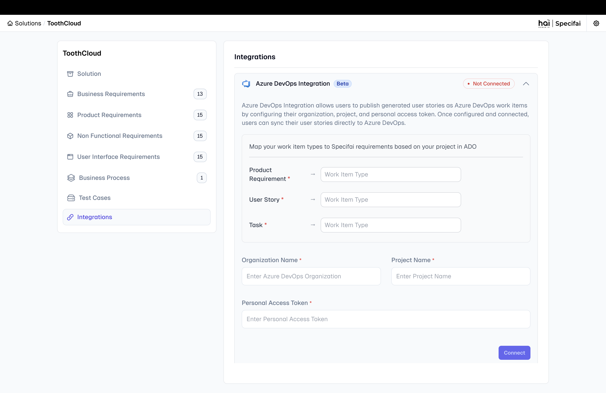
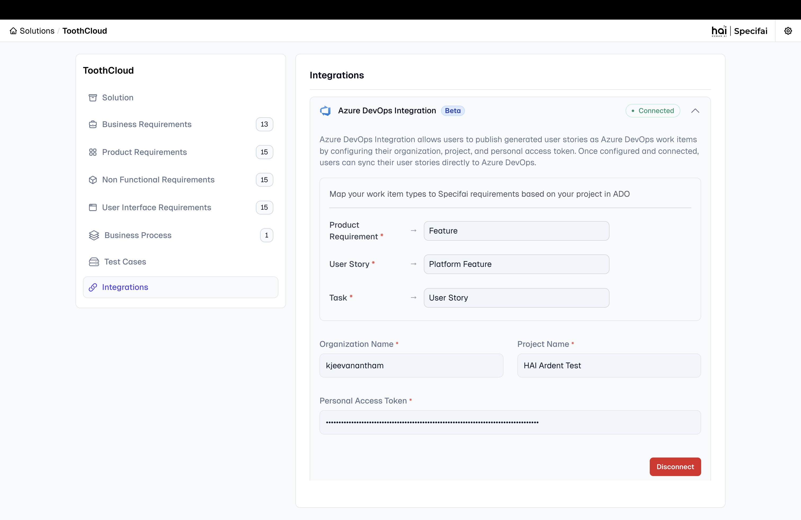

# Azure DevOps Integration Guide for Specifai

This guide explains how to integrate the Specifai solution with Azure DevOps using Personal Access Tokens (PAT). Follow these steps to create a PAT, configure permissions, and set up the integration for seamless work item synchronization.

## Step 1: Create a Personal Access Token in Azure DevOps

1. **Access Your Azure DevOps Organization:**
   - Open a web browser and navigate to your Azure DevOps organization (e.g., `https://dev.azure.com/{your-organization}`).
   - Sign in with your Azure DevOps credentials.

2. **Navigate to Personal Access Tokens:**
   - Click on your profile picture in the top-right corner.
   - Select **Personal access tokens** from the dropdown menu.
   - Click **+ New Token** to create a new PAT.

3. **Configure the Token:**
   - Enter a **Name** for the token, such as "Specifai Integration Token."
   - Set the **Expiration** date (recommended: 1 year or custom date based on your security policies).
   - Select the **Organization** where your projects are located.

## Step 2: Configure Scopes and Permissions

1. **Select Custom Defined Scopes:**
   - Choose **Custom defined** to specify the exact permissions needed.

2. **Add Required Scopes:**
   - **Work Items**: Select **Read & write** to allow reading and creating/updating work items.
   - **Project and team**: Select **Read** to access project information.

3. **Create the Token:**
   - Click **Create** to generate the Personal Access Token.
   - **Important**: Copy the token immediately and store it securely. You won't be able to see it again.

## Step 3: Identify Your Organization and Project Details

1. **Find Your Organization Name:**
   - Your organization name is visible in the URL: `https://dev.azure.com/{organization-name}`
   - Example: If your URL is `https://dev.azure.com/contoso`, your organization name is `contoso`.

2. **Identify Your Project Name:**
   - Navigate to your Azure DevOps project.
   - The project name is displayed in the breadcrumb navigation and URL.
   - Example: `https://dev.azure.com/contoso/MyProject` - the project name is `MyProject`.

## Step 4: Configure Work Item Types (Optional)

Specifai supports mapping between its document types and Azure DevOps work item types. The default mapping is:

- **PRD (Product Requirements Document)** → **Feature**
- **User Story** → **Platform Feature**
- **Task** → **User Story**

If your Azure DevOps project uses different work item types, you can configure custom mappings in the integration settings.

## Step 5: Set Up the Integration in Specifai

1. **Open the Integration Page:**
   - Launch the Specifai application and navigate to your solution.
   - Go to **Solution** → **Integration** page.
   

2. **Enter the Azure DevOps Configuration:**
   - Provide the following information in the Azure DevOps Integration section:
     - **Organization**: Enter your Azure DevOps organization name (without the URL).
     - **Project Name**: Enter the exact project name from Azure DevOps.
     - **Personal Access Token**: Paste the PAT you created in Step 1.

3. **Configure Work Item Type Mapping (Optional):**
   - If your project uses custom work item types, configure the mapping:
     - **PRD Maps To**: Default is "Feature"
     - **User Story Maps To**: Default is "Platform Feature"  
     - **Task Maps To**: Default is "User Story"

4. **Verify the Configuration:**
   - Ensure all fields are correctly filled.
   - The organization name should match exactly (case-sensitive).
   - The project name should match the Azure DevOps project name exactly.

5. **Test & Save the Configuration:**
   - Click **Test Connection** to validate your credentials and configuration.
   - If successful, click **Save** to store the configuration.

6. **Successful Connection:**
   - If the connection is successful, you will see a confirmation message.
   

## Step 6: Using the Azure DevOps Integration

### Pull from Azure DevOps (ADO → Specifai)

1. **Access the Integration Modal:**
   - Navigate to your solution's integration page.
   - Click on **Sync with Azure DevOps** or the ADO integration button.

2. **Select Work Items to Import:**
   - The system will display a hierarchical view of your Azure DevOps work items:
     - **Features** (mapped to PRDs)
     - **Platform Features** (mapped to User Stories)
     - **User Stories** (mapped to Tasks)

3. **Import Selected Items:**
   - Select the work items you want to import into Specifai.
   - Click **Pull from ADO** to import the selected items.
   - The system will create corresponding PRD, User Story, and Task files in your Specifai project.

### Push to Azure DevOps (Specifai → ADO)

1. **Select Items to Export:**
   - Choose the PRDs, User Stories, and Tasks you want to push to Azure DevOps.
   - The system maintains the hierarchical relationships during export.

2. **Push to ADO:**
   - Click **Push to ADO** to create corresponding work items in Azure DevOps.
   - The system will create Features, Platform Features, and User Stories with proper parent-child relationships.

### Bidirectional Synchronization

- **Update Existing Items**: The integration can update existing work items in both directions.
- **Maintain Relationships**: Parent-child relationships are preserved during synchronization.
- **Bulk Operations**: Import or export multiple work items efficiently.

## Troubleshooting

### Common Issues

1. **Authentication Failed:**
   - Verify your Personal Access Token is correct and hasn't expired.
   - Ensure the PAT has the required scopes (Work Items: Read & write).

2. **Organization/Project Not Found:**
   - Double-check the organization and project names for exact spelling and case sensitivity.
   - Ensure you have access to the specified project.

3. **Work Item Creation Failed:**
   - Verify your PAT has write permissions for work items.
   - Check if the work item types exist in your Azure DevOps project.

4. **Hierarchy Issues:**
   - Ensure your Azure DevOps project supports the work item hierarchy (Feature → Platform Feature → User Story).
   - Verify the work item type mappings are correct for your project.

### Security Best Practices

- **Token Management**: Regularly rotate your Personal Access Tokens.
- **Minimal Permissions**: Only grant the minimum required scopes to your PAT.
- **Secure Storage**: Store your PAT securely and never commit it to version control.
- **Monitor Usage**: Regularly review PAT usage in Azure DevOps security settings.

---

By following these steps, you can successfully integrate Specifai with Azure DevOps for seamless work item management and synchronization.
