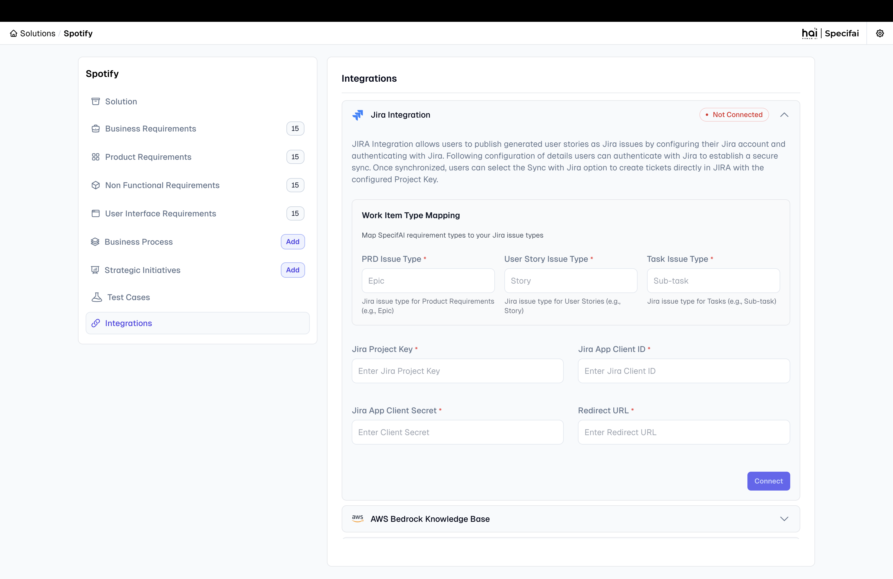

# Jira OAuth 2.0 Integration Guide for Specifai

This guide explains how to integrate the Specifai solution with Jira using OAuth 2.0. Follow these steps to create an OAuth app, configure permissions, and set up the integration.

## Step 1: Create an OAuth 2.0 Integration

1. **Access the Atlassian Developer Console:**

   - Open a web browser and navigate to the [Atlassian Developer Console](https://developer.atlassian.com/console/myapps/).
   - Sign up with Atlassian credentials if you haven't created an account yet.

2. **Create a New OAuth App:**

   - Log in and click the **Create New App** button.
   - Select **OAuth 2.0 Integration** from the options.
   - Enter a name for the app, such as "Specifai Integration."
   - Click **Create App** to proceed.

3. **Navigate to the App Configuration:**
   - After creating the app, access the configuration page for the new OAuth app.

## Step 2: Configure Permissions for the App

1. **Access the Permissions Tab:**

   - Open the **Permissions** tab in the app's configuration screen to define the APIs accessible by the app.

2. **Add the Required APIs:**

   - Under the Permissions section, click **Add APIs** and select the following:
     - **User Identity API**: Identifies users interacting with the app.
     - **Jira API**: Grants access to Jira.

3. **Configure Classic Scopes for Jira API:**
   - After adding the Jira API, click **Edit Scopes** under the Jira API section to set the level of access.
   - Add the following scopes:
     - `read:jira-work`: Allows reading Jira project and issue information.
     - `read:jira-user`: Enables reading Jira user information.
     - `write:jira-work`: Provides write access to Jira issues, such as creating or updating tasks.
   - Save the changes.

## Step 3: Configure Authorization

1. **Go to the Authorization Tab:**

   - Open the **Authorization** tab in the app configuration screen.

2. **Select OAuth 2.0 Authorization:**

   - Choose **OAuth 2.0** as the authorization type to enable OAuth-based authentication between Jira and the Specifai.

3. **Set the Callback URL:**
   - Enter the **Callback URL** for the Requirements app. This URL is where users will be redirected after authorizing the app.
     - Expected default value : `http://localhost:12345/callback`
       > **Note**: If you modify the port value, replace it with your app's actual callback URL, updating the port accordingly.
   - Click **Save** to apply the configuration.

## Step 4: Retrieve OAuth Credentials

1. **Go to the Settings Tab:**

   - Open the **Settings** tab in the app configuration screen.

2. **Copy the Client ID and Client Secret:**
   - Locate the **Client ID** and **Client Secret**:
     - **Client ID**: Serves as a unique identifier for the app.
     - **Client Secret**: Used for authentication. Store it securely.
   - Keep both credentials safe, as they are required for OAuth authentication in the Requirements app.

## Step 5: Configure Work Item Type Mapping (Optional)

Specifai supports mapping between its document types and Jira issue types. The default mapping is:

- **PRD (Product Requirements Document)** → **Epic**
- **User Story** → **Story**
- **Task** → **Task**

If your Jira project uses different issue types, you can configure custom mappings in the integration settings.

## Step 6: Set Up the Integration in Specifai

1. **Open the Integration Page:**

   - Launch the Specifai application and navigate to your solution.
   - Go to **Solution** → **Integration** page.
     

2. **Enter the OAuth Credentials:**

   - Provide the following information in the Jira Integration section:
     - **Client ID**: Enter the unique identifier from the Atlassian Developer Console.
     - **Client Secret**: Enter the secret from the console.
     - **Project Key**: Specify the Jira project for integration. The key can be found on the Jira project settings page.
     - **Callback URL**: Enter the URL specified during the authorization setup.

3. **Configure Work Item Type Mapping (Optional):**

   - If your project uses custom issue types, configure the mapping:
     - **PRD Maps To**: Default is "Epic"
     - **User Story Maps To**: Default is "Story"
     - **Task Maps To**: Default is "Task"

4. **Verify the Configuration:**

   - Ensure that the **Client ID**, **Client Secret**, and **Callback URL** match the information entered in the Atlassian Developer Console.
   - Confirm that the **Project Key** is correct, as it identifies the Jira project that the app will interact with.

5. **Connect & Save the Configuration:**

   - Click the **Connect** button to initiate the OAuth flow.

6. **Authorize the App:**

   - A new browser window will open, prompting you to authorize the app.
   - Review the permissions requested by the app and click **Allow** to grant access.
     
     _JIRA OAuth consent screen_

7. **Successful Connection:**
   - If the connection is successful, you will see a confirmation message indicating that the integration is connected.
     

## Step 8: Using the Jira Integration

### Pull from Jira (Jira → Specifai)

1. **Navigate to PRD Page:**

   - Navigate to your PRD page in Specifai.
   - From the options menu, click **Pull from Jira**.

     

2. **Select Issues to Import:**

   - The system will display a hierarchical view of your Jira issues:
     - **Epics** (mapped to PRDs)
     - **Stories** (mapped to User Stories)
     - **Tasks** (mapped to Tasks)

   
   _Hierarchical view for selecting Jira issues to import_

3. **Hierarchical Selection:**

   - Use the tree view to select specific issues you want to import.
   - Parent-child relationships are maintained:
     - Select an Epic to import the entire feature with all its stories and tasks
     - Select individual Stories to import specific user stories with their tasks
     - Select individual Tasks for granular import
   - Use checkboxes to select/deselect items at any level of the hierarchy.

4. **Import Selected Items:**

   - Review your selections in the hierarchical tree.
   - Click **Pull from Jira** to import the selected issues into Specifai.
   - The system will create corresponding PRD, User Story, and Task files in your Specifai project.

   

### Push to Jira (Specifai → Jira)

1. **Select Items to Export:**

   - Navigate to your PRD page in Specifai.
   - From the options menu, click **Push to Jira**.

2. **Hierarchical Export Selection:**

   - The system will display your Specifai documents in a hierarchical view:
     - **PRDs** (will become Epics)
     - **User Stories** (will become Stories)
     - **Tasks** (will become Tasks)

   
   _Hierarchical view for selecting Specifai documents to push to Jira_

3. **Choose Export Options:**

   - Select the PRDs, User Stories, and Tasks you want to push to Jira.
   - The system maintains hierarchical relationships during export:
     - PRDs become Epics
     - User Stories become Stories linked to their parent Epic
     - Tasks become Tasks linked to their parent Story

4. **Push to Jira:**
   - Review your selections and click **Push to Jira**.
   - The system will create corresponding issues in Jira with proper parent-child relationships.

### Bidirectional Synchronization

- **Update Existing Items**: The integration can update existing issues in both directions.
- **Maintain Relationships**: Parent-child relationships (Epic → Story → Task) are preserved during synchronization.
- **Bulk Operations**: Import or export multiple issues efficiently with hierarchical selection.
- **Conflict Resolution**: The system handles conflicts by preserving the most recent changes.
