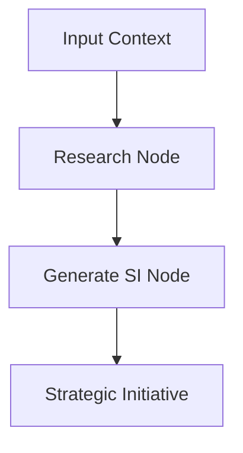

# Advanced Architecture of Specifai 🏗️

Understand the advanced architectural components and intelligent workflows that power Specifai's requirement generation.

---

## 📋 What's Inside

This guide covers:
- Application Architecture
- Solution Creation Workflow
- User Story Generation Process
- Test Case Generation Process
- Strategic Initiative Workflow
- Security and Safety Measures

---

## 🏛️ Application Architecture

Specifai is built as a robust Electron application, combining a modern frontend with a powerful backend.

<div align="center">


*Specifai's core architectural components*

</div>

### Core Components

* **Angular UI:** Provides a rich, responsive frontend interface.
* **Node.js Backend:** Handles core application logic, data processing, and system integrations within the main Electron process.
* **File System:** Serves as the primary data storage for application-specific information.
* **Network LLM Integration:** Manages secure network calls to external AI services for language model operations.

#### Electron Process Model

* **Main Process:**
    * **Event Management:** Manages system-wide events and application state changes.
    * **File System Operations:** Handles all data persistence and I/O.
    * **LLM Integration:** Executes network requests and manages communication with external AI services.
* **Renderer Process:**
    * **Angular Components:** Renders the user interface and manages user interactions.
    * **State Management:** Manages local UI state for responsiveness.
    * **IPC Communication:** Facilitates secure, asynchronous communication with the Main Process via Inter-Process Communication.

---

## 🔄 Solution Creation Workflow

Specifai's solution creation leverages an advanced agentic workflow, intelligently orchestrating data processing and document generation.

<div align="center">


*Agentic workflow for solution creation*

</div>

### Agentic Flow Phases

1.  **Research Phase:**
    * **Context Gathering:** Collects and analyzes various input data sources.
    * **Information Processing:** Structures and organizes the gathered information.
    * **Context Refinement:** Iteratively refined using MCP Tools for enhanced context.
    * **Quality Validation:** Ensures data completeness and accuracy before generation.

2.  **Generation Phase:**
    This phase transforms structured data into comprehensive requirement documentation.

    ```mermaid
    graph TD
      A[Solution Information] --> B[BRD Generation]
      B --> C[PRD Generation]
      A --> D[NFR Generation]
      A --> E[UIR Generation]
      B --> F[Final Solution]
      C --> F
      D --> F
      E --> F
    ```

### Agent Orchestration

Within the Node.js backend, specialized agents collaborate to enhance context, refine AI responses, and assure output quality. This includes leveraging **MCP tools** for enriched contextual understanding during the research and generation processes.

---

## 📝 User Story Generation Process

User Story generation in Specifai also follows a sophisticated agentic workflow, ensuring high-quality, contextually relevant outputs.

### Flow Components

* **Story Formation:**
    * **Context Analysis:** Processes requirement context using specialized agents.
    * **Acceptance Criteria:** Generates clear acceptance criteria with LLM assistance.
    * **Quality Metrics:** Applies predefined quality standards through validation agents.
* **Agentic Processing:**
    * **MCP Tool Integration:** Leverages connected knowledge bases and tools for enhanced contextual understanding.
    * **Output Enhancement:** Refines generated content through iterative improvements by dedicated agents.
    * **Validation Steps:** Ensures story completeness and alignment with overall solution requirements.

This iterative, agent-driven process ensures comprehensive coverage and consistency with the broader solution architecture.

---

## 🧪 Test Case Generation Process

Test case generation ensures comprehensive coverage through intelligent AI agents that analyze user stories, technical constraints, and business logic to produce validated test cases covering all aspects.

### Flow Overview

* **Test Case Generation:**
    * **Contextual Analysis:** Gathers context from user stories, acceptance criteria, technical constraints, and their parent product requirement documents. Also gathers information about UI screens involved from the user.
* **Agentic Workflow:**
    * **Research & Analysis** - Gathers context from user stories, acceptance criteria, their parent Product Requirement Document (PRD), and technical constraints to understand testing scope. MCP Tools are also used for research to enhance context.
    * **Intelligent Generation** - Creates comprehensive test cases covering functional, integration, edge cases, and negative scenarios with structured format.
    * **Quality Evaluation** - Validates generated test cases against coverage criteria, clarity standards, and best practices with iterative refinement (up to 3 cycles).

---

## 🎯 Strategic Initiative Workflow

Strategic Initiative generation in Specifai leverages an advanced two-phase agentic workflow to create high-level organizational objectives that align technical efforts with business goals.

### Workflow Architecture

The Strategic Initiative workflow follows a structured, sequential process:



1. **Research Phase:**
   * Utilizes available tools, including MCP tools, to gather context
   * Processes solution details and project requirements
   * Incorporates research URLs provided as input references
   * Creates a comprehensive reference summary for the generation phase

2. **Generation Phase:**
   * Processes the research results and project context
   * Produces a structured strategic initiative with title and detailed content
   * Formats the output for integration into the wider system

### Research URL Integration

The Strategic Initiative workflow includes support for external research URLs:

* **Implementation:**
  * External URLs can be provided via the `researchUrls` array in the request
  * These URLs serve as reference points for the research phase
  * The system incorporates this additional context into the initiative generation process

* **Benefits:**
  * Enhanced context from external resources
  * More comprehensive strategic initiatives
  * Better alignment with market research and industry standards

---

## 🛡️ Security and Safety

Specifai integrates **hai-guardrails** throughout its architecture to ensure robust security and content safety, particularly within AI-driven workflows.

### Hai-Guardrails Integration

The guardrails system is implemented at multiple architectural levels:

* **Content Filtering:** Implements robust content filtering and validation for security keys and tokens.
* **Safe Prompt Handling:** Ensures all prompts adhere to defined security guidelines.

### Implementation Points

* Integrated within the chat flow for real-time validation.
* Applied during content generation safety checks.
* Enforces comprehensive security policies across the application.

---

## 🔍 Next Steps

1. **Troubleshoot:** Consult the [Troubleshooting Guide](troubleshooting.md) for common issues and resolutions.
2. **Explore Codebase:** For developers, delve into the codebase to understand the implementation of these architectural patterns.

---
