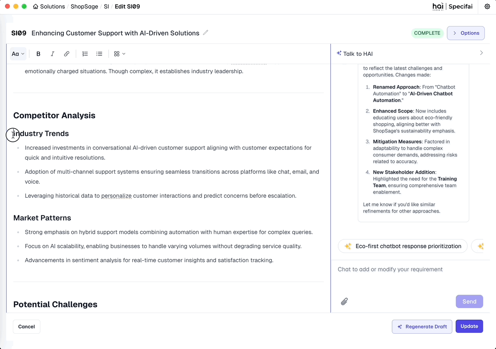

# Intelligent Requirement Interaction ✨

Specifai offers powerful intelligent requirement interaction capabilities that enhance your workflow. This guide covers the Intelligent Chat Interface and Intelligent Inline Editing features.

## 💬 AI Chat Interface

The Intelligent Chat Interface is your on-demand SDLC assistant within Specifai. It uses natural language understanding and context awareness to streamline your requirements management.

*Your intelligent chat for real-time assistance*

### Key Capabilities

1.  **Natural Language Understanding:**
    * Engage with the system using everyday language. The chat interprets your intent and context to perform relevant actions.
    * Ask questions like:
        * *"Can you refine the BRD for authentication based on SSO?"*
        * *"Add NFR data privacy guidelines."*
        * *"What are the UI constraints for the login module?"*
        * *"Explain the requirement for the checkout process."*

2.  **Smart Suggestions:**
    * Receive intelligent recommendations, clarifications, and industry best practices. It identifies vague inputs for improved quality.
    * Leverages connected **AWS Knowledge Bases** (if configured) for context-aware suggestions from your organizational data.

3.  **Context-Aware Actions:**
    * The chat uses solution metadata and linked requirement documents (like BRDs, PRDs for User Story context) to tailor responses.
        * Ask questions like:
        * *"What are the relevant BRDs for the current PRD?"*
        * *"What are the linked User Stories?"*
        * *"What are the linked Tasks for the current User Story?"*
    * Gathers additional context from **MCP Servers** (like AWS Bedrock Knowledge Base or Custom File System MCP Server) to enhance chat suggestions and guides conversation.

4.  **Iterative Conversations:**
    * Refine requirements through engaging, back-and-forth discussions. The chat remembers previous interactions for a natural flow.
    * Seamlessly handle multiple topics and contexts.

5.  **Seamless Collaboration:**
    * Collaborate across teams with a shared chat interface.
    * It's great for onboarding new team members and aligning stakeholder understanding.

---

## 🪄 AI-Powered Inline Editing

Specifai's inline editing feature allows you to instantly improve any text within editable fields using intelligent assistance, without disrupting your workflow.

*Inline Editing Demo*

### How to Use Inline Editing

1. **Select Text:** Highlight any text you want to improve in your requirements, user stories, or descriptions.
2. **Activate Intelligence:** Click the ✨ sparkle icon that appears near your selection.
3. **Provide Instructions:** Enter specific instructions like "Make this more concise" or "Add technical details."
4. **Apply Changes:** Review the intelligent suggestions and click "Accept" to apply them to your document.

### Best Practices

* **Be Specific:** Give clear instructions for better results (e.g., "Convert to bullet points highlighting key features").
* **Select Appropriately:** Include enough context for the system to understand what you're trying to improve.
* **Iterate:** Start with general improvements, then refine with more specific editing passes.

### Use Cases

* Improve requirement clarity and specificity
* Enhance technical descriptions with proper terminology
* Convert vague user stories into structured formats with acceptance criteria
* Fix grammar and improve readability of documentation
* Standardize content format across documents

---
