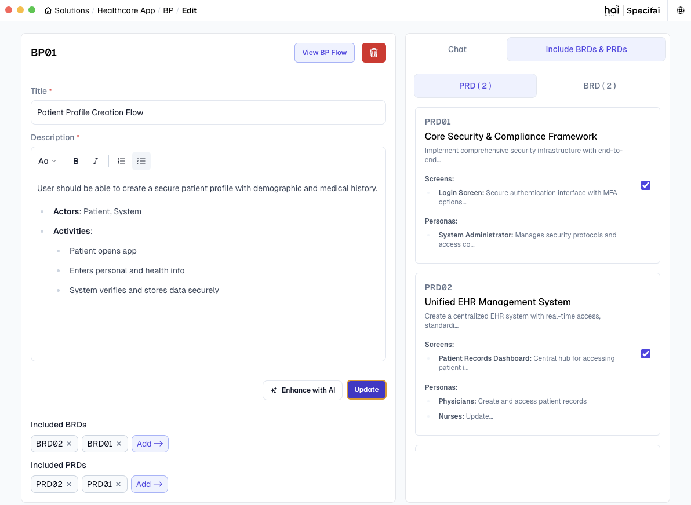
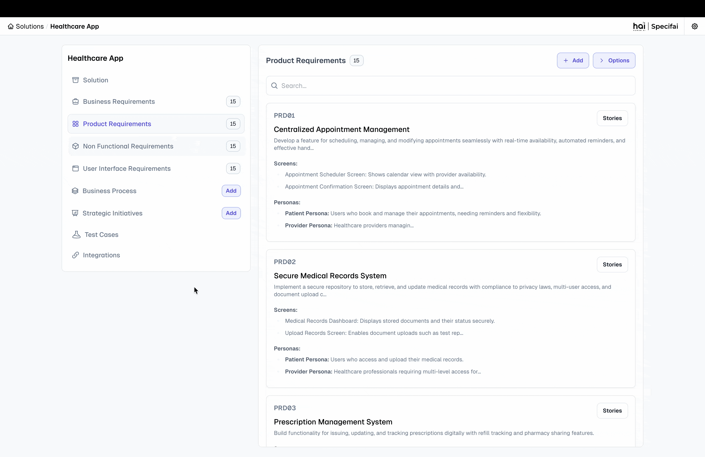
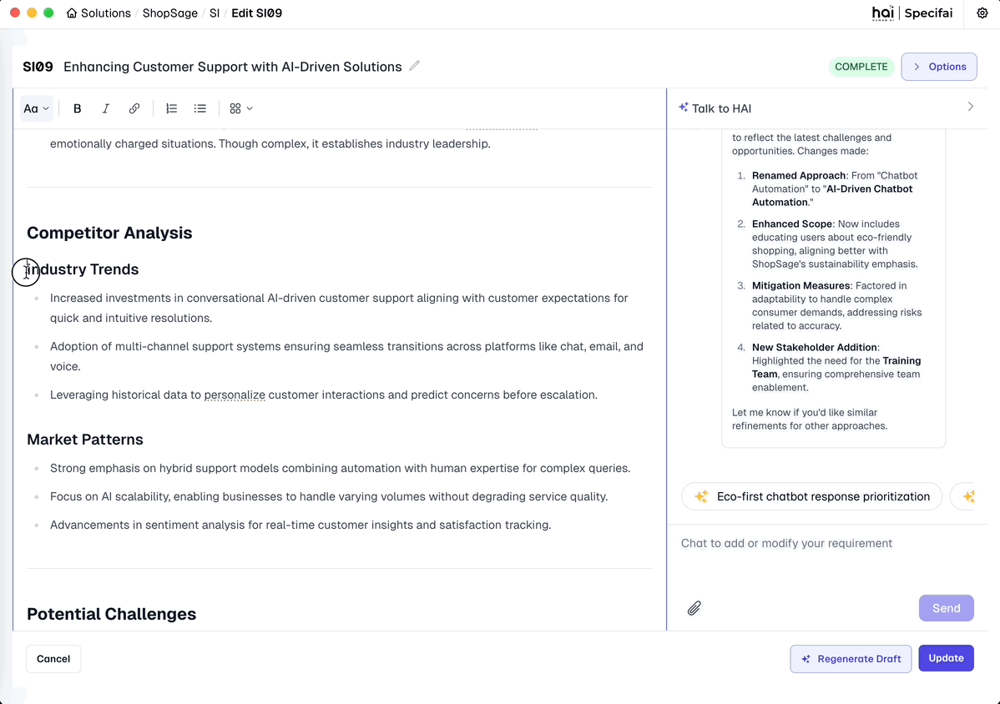

# Core Features of Specifai 🌟

Discover the powerful features that make Specifai your ultimate companion for SDLC process acceleration! This guide walks you through each major feature with practical examples and best practices.

---

## 📋 What's Inside

- Solution Creation & Structure
- Requirements Document Types & Best Practices
- Visualizing Business Workflows
- Organizing & Refining Requirements
- Intelligent Chat Interface
- Automating User Story & Task Creation
- Model Configuration
- AI-Powered Inline Editing
- Export & Integration Options

---

## 🎯 Solution Creation

### Creating Your First Solution
<div align="center">


*Transform your ideas into well-structured solutions in minutes*

</div>

1.  **Launch Solution Creation:**
    * Click the "**New Solution**" button on your dashboard.
    * > **Pro tip:** Keep the dashboard organized by using clear naming conventions.

2.  **Define Solution Details:**
    * **Solution Name**: Choose a clear, descriptive name.
        * **Good example:** "Task-Management-System"
        * **Avoid:** Generic names like "New Project."
    * **Description**: Provide comprehensive context.
        * Include business objectives, key stakeholders, and primary goals.
        * Mention any third-party integrations or compliance requirements.
    * **Technical Stack**: Specify your technology choices, such as:
        * **Frontend frameworks** (e.g., React, Angular)
        * **Backend technologies** (e.g., Node.js, Java)
        * **Databases** (e.g., PostgreSQL, MongoDB)
        * **Infrastructure** (e.g., AWS, Azure)
    * **Is solution built already?**: Configure requirement generation preferences using this toggle.
        * **When enabled:** No requirements will be automatically generated, giving users more control over requirement creation.
        * **When disabled:** Specifai starts fresh with new requirement generation based on the provided context.

3.  **Configure Solution Preferences:**
    Set the minimum number of requirements (default: 15) to be generated for BRD, PRD, UIR, and NFR types. Adjust this based on your project's scope.

4.  **MCP Integration Setup:**
    Enhance your solution with Model Context Protocol (MCP) servers:
    * **AWS Bedrock KB:**
        * Connect to an AWS Bedrock Knowledge Base.
        * Leverage enterprise knowledge for better context.
        * Enable advanced AI capabilities.
    * **Custom MCP Server:**
        * Add new MCP servers for extended functionality.
        * Configure custom integrations and access additional AI models and tools.
    * For detailed setup, refer to our [MCP Integration Guide](integrations-setup.md#-model-context-protocol-mcp-integration).

5.  **Create Solution Space:**
    * Click "**Create**" to initialize your solution with requirements and MCP configurations.
    * Watch as Specifai sets up your workspace with AI-powered intelligence.

### Understanding Solution Structure
Each solution follows a modular, scalable structure:

```
📁 Solution Root Folder
├── 📄 .metadata.json            # Solution configuration
├── 📁 BRD                       # Business Requirements
│   ├── 📄 BRD01-base.json
│   └── 📄 BRDxx-base.json
├── 📁 NFR                       # Non-Functional Requirements
│   ├── 📄 NFR01-base.json
│   └── 📄 NFRxx-base.json
├── 📁 PRD                       # Product Requirements
│   ├── 📄 PRD01-base.json
│   ├── 📄 PRD01-feature.json    # User Stories & Tasks
│   ├── 📄 PRDxx-base.json
│   └── 📄 PRDxx-feature.json
├── 📁 UIR                       # User Interface Requirements
│   ├── 📄 UIR01-base.json
│   └── 📄 UIRxx-base.json
└── 📁 BP                        # Business Process Flows
    ├── 📄 BP01-base.json
    └── 📄 BPxx-base.json
```

#### Key Components

1.  **🔖 Metadata Configuration (`.metadata.json`)**
    This file stores essential solution details:
    * Solution name and description
    * Technical stack details
    * Creation and modification timestamps
    * MCP Tools configuration

2.  **📑 Document Folders**
    Each folder contains specific requirement types:
    * **BRD**: Business objectives & stakeholder needs.
    * **PRD**: Technical specs & implementation details.
    * **User Stories**: Actionable items from PRD.
    * **Tasks**: Breakdown of user stories.
    * **NFR**: Performance & security requirements.
    * **UIR**: UI/UX design guidelines.

3.  **📊 Business Process Flows (`BP`)**
    This folder contains visual representations of your key business processes.

---

## 📝 Requirements Document Types and Best Practices

Specifai streamlines the creation of essential SDLC documents through AI-powered generation and intuitive management. Below are the key document types Specifai helps you define and manage:

<div align="center">


*AI-powered document generation workflow*

</div>

### 1. Business Requirements (BRD)

#### What is a BRD?
A **Business Requirements Document (BRD)** is a formal document that describes the business solution for a project. It includes the user's needs and expectations, the product's purpose and objectives, and any high-level constraints or dependencies. It serves as a bridge between business objectives and technical implementation, ensuring all stakeholders have a clear understanding of what needs to be achieved.

#### Best Practices for Writing BRDs
* Start with a clear business objective.
* Include stakeholder impact analysis.
* Define measurable success criteria.
* Specify regulatory/compliance requirements.
* Document assumptions and constraints.
* Include a cost-benefit analysis.
* Reference related industry standards.
* Maintain traceability to business goals.

#### Example BRD
<div align="center">


*Business Requirements Document interface in Specifai*

</div>

### 2. Product Requirements (PRD)

#### What is a PRD?
A **Product Requirements Document (PRD)** is a technical document that outlines the specific requirements, features, and functionalities of a product or system. It translates business requirements into detailed technical specifications that guide development teams in implementing the solution effectively. **PRDs can be linked to relevant BRDs** to ensure alignment between business needs and technical implementation.

#### Best Practices for Writing PRDs
* Define system interfaces and integration points.
* Specify data models and state transitions.
* Document error scenarios and recovery paths.
* Include performance SLAs and scalability targets.

#### Example PRD

<div align="center">


*Product Requirements Document interface in Specifai*

</div>

### 3. User Stories (US)

#### What are User Stories?
**User Stories** are concise descriptions of functionality from an end user's perspective. They capture what users want to achieve, why they want it, and what value it brings to them. User stories help teams understand the user's needs and expectations.

#### Best Practices for Writing User Stories
* Link to specific business capabilities.
* Include technical dependencies and constraints.
* Define clear validation criteria.
* Specify data requirements and state changes.
* **Story Format**:
    ```
    As a [user type]
    I want to [action]
    So that [benefit]
    ```

#### Example User Story

<div align="center">


*User Story details interface in Specifai*

</div>

### 4. Tasks

#### What are Tasks?
**Tasks** are specific, actionable items that break down the implementation of user stories into manageable pieces of work. They represent the technical steps needed to deliver the functionality described in user stories.

#### Best Practices for Writing Tasks
* Define technical acceptance criteria.
* Specify test scenarios and edge cases.
* Document system dependencies.
* Include rollback procedures.

#### Example Task

<div align="center">


*Task details interface in Specifai*

</div>

### 5. Non-Functional Requirements (NFR)

#### What are NFRs?
**Non-Functional Requirements (NFRs)** define the quality attributes and operational characteristics of a system. Unlike functional requirements that specify what the system should do, NFRs describe *how* the system should perform, focusing on criteria that can be used to judge the system's operation rather than specific behaviors.

#### Best Practices for Writing NFRs
* Define quantifiable metrics for each requirement.
* Specify monitoring and alerting thresholds.
* Document compliance validation methods.
* Include performance test scenarios.

#### Example NFR

<div align="center">


*Non-Functional Requirements interface in Specifai*

</div>

### 6. User Interface Requirements (UIR)

#### What are UIRs?
**User Interface Requirements (UIRs)** define the visual, interactive, and experiential aspects of a system's user interface. They ensure consistency in design, optimal user experience, and adherence to brand guidelines while maintaining accessibility and usability standards.

#### Best Practices for Writing UIRs
* Define component-specific accessibility requirements.
* Document responsive breakpoints and behaviors.
* Specify interaction states and transitions.
* Include performance metrics for UI components.

#### Example UIR

<div align="center">


*User Interface Requirements interface in Specifai*

</div>

---

## 📊 Visualizing Business Workflows

### What is a Business Process Flow?

A **Business Process Flow (BP Flow)** is a visual representation of the steps, decisions, and interactions involved in a business process. It helps teams understand the workflow, identify bottlenecks, and optimize processes for efficiency.

### Benefits of BP Flows
* **Clarity**: Provides a clear overview of complex processes.
* **Collaboration**: Facilitates discussions among stakeholders.
* **Optimization**: Identifies inefficiencies and areas for improvement.
* **Documentation**: Serves as a reference for process standards and compliance.

<div align="center">


*Business process flow visualization in action within Specifai*

</div>

### How to Create and Manage BP Flows

1.  **Basic Information:**
    * Enter a descriptive title.
    * Provide a detailed process description.
    * Link relevant BRDs and PRDs for context.

<div align="center">


*Business process flow configuration interface*

</div>

2.  **Automatic Flow Generation:**
    * Enjoy AI-powered flow diagram generation.
    * Benefit from intelligent process analysis based on your linked requirements and BP context.

<div align="center">


*AI-powered flow diagram generation in action*

</div>

3.  **Flow Management:**
    * View generated process flows.
    * Download flow diagrams.
    * Regenerate flows as needed.

### Best Practices for BP Flows
* **Input Quality**:
    * Use clear, detailed descriptions, including all actors involved and activities performed.
    * Link all relevant BRDs & PRDs for comprehensive context.
    * Ensure you provide a comprehensive business flow context to the AI.

---

## ✍️ Organizing and Refining Your Requirements

Once your initial documents are generated, Specifai provides robust tools to organize and refine your requirements (BRD, PRD, User Stories, Tasks, NFR, UIR, & BP).

### 1. Adding Requirements
* **Fill in Basic Details:**
    * **Title**: Write a clear, descriptive title that reflects the requirement's purpose.
    * **Description**: Provide comprehensive details about functionality, constraints, and goals.
    * **Code References**: Upload relevant code files to provide implementation context.
* **Enhance with AI:**
    * Click the "**Enhance with AI**" button to improve requirement quality.
    * Requirements are automatically saved when enhanced.
* Use the "**Add**" button to create the new requirement.

<div align="center">


*Interface for adding a requirement (e.g., a BRD)*

</div>

### 2. Updating Requirements
* **Select and Modify:**
    * Click any requirement to open it for editing.
    * Update the title and description as needed. Changes are auto-saved as you type.
* **AI Enhancement:**
    * Use "**Enhance with AI**" to improve existing content.
    * Review and apply AI suggestions as needed from the AI Chat Interface on the right side of the screen.

<div align="center">


*Updating a requirement with AI assistance*

</div>

> 💡 **Pro Tip:** Use the AI chat interface for real-time suggestions and improvements when updating requirements.

<div align="center">


*The AI Chat Interface assisting with requirement updates*

</div>

### 3. Deleting Requirements
* **Remove Requirements:**
    * Click the "**Delete**" button on any requirement.
    * Confirm deletion in the verification dialog.
    * Requirements are soft-deleted for safety.
* **Archival System:**
    * Deleted requirements are stored in the HAI Solution Folder.
    * Full history and relationships are preserved, allowing you to recover deleted requirements when needed.

---

## 💬 AI Chat Interface

The AI Chat Interface is your on-demand SDLC assistant within Specifai. It uses natural language understanding and context awareness to streamline your requirements management.

<div align="center">


*Your AI-powered chat for real-time assistance*

</div>

### Key Capabilities

1.  **Natural Language Understanding:**
    * Engage with the AI using everyday language. The chat interprets your intent and context to perform relevant actions.
    * Ask questions like:
        * *"Can you refine the BRD for authentication based on SSO?"*
        * *"Add NFR data privacy guidelines."*
        * *"What are the UI constraints for the login module?"*
        * *"Explain the requirement for the checkout process."*

2.  **Smart Suggestions:**
    * Receive intelligent recommendations, clarifications, and industry best practices. It identifies vague inputs for improved quality.
    * Leverages connected **AWS Knowledge Bases** (if configured) for context-aware suggestions from your organizational data.

3.  **Context-Aware Actions:**
    * The chat uses solution metadata and linked requirement documents (like BRDs, PRDs for User Story context) to tailor responses.
        * Ask questions like:
        * *"What are the relevant BRDs for the current PRD?"*
        * *"What are the linked User Stories?"*
        * *"What are the linked Tasks for the current User Story?"*
    * Gathers additional context from **MCP Servers** (like AWS Bedrock Knowledge Base or Custom File System MCP Server) to enhance chat suggestions and guides conversation.

4.  **Iterative Conversations:**
    * Refine requirements through engaging, back-and-forth discussions. The chat remembers previous interactions for a natural flow.
    * Seamlessly handle multiple topics and contexts.

5.  **Seamless Collaboration:**
    * Collaborate across teams with a shared chat interface.
    * It's great for onboarding new team members and aligning stakeholder understanding.

---

## 📝 Automating User Story & Task Creation

This feature enables the seamless generation of user stories and associated tasks from a selected Product Requirement Document (PRD). It leverages an intelligent **Agentic Flow** that interprets the provided context to produce meaningful and actionable development items.

<div align="center">


*AI-powered user story generation in action*

</div>

### 🔹 How It Works

1.  **Select a PRD:**
    Begin by selecting the relevant PRD from the available list.

2.  **Click on 'Generate Stories':**
    Once the PRD is selected, click the **Generate Stories** button.

3.  **Provide Context in the Popup:**
    A popup window will appear, prompting you to gather additional context or clarification to guide the generation process.

4.  **User Story & Task Generation:**
    Upon submission, the backend **Agentic Flow** is triggered. It performs two key actions:
    * It generates **User Stories** based on the selected PRD and the provided context.
    * If MCP servers are configured (like AWS Bedrock Knowledge Base), the Agentic flow uses them to enhance context and improve the quality of generated stories.
    * It automatically invokes the **Generate Tasks** workflow for each generated story, creating well-defined tasks under each story.

### 🔄 Regeneration Support

You can regenerate user stories and tasks at any time. When this action is triggered:

<div align="center">


*Story regeneration interface with archival support*

</div>

* All previously generated user stories and tasks are **automatically archived**.
* A **new set of user stories and tasks** is created based on the latest context and PRD selection.

This ensures the system always reflects the most current understanding of requirements while maintaining historical traceability.

---

## 🧠 Model Configuration

Specifai offers flexible AI model configuration, allowing you to choose and connect to various powerful language models to best suit your project's needs.

> For detailed setup instructions, refer to our [Getting Started Guide](getting-started.md#3-ai-model-configuration-).

<div align="center">


*Easily configurable multi-provider AI model support*

</div>

---

## 🪄 AI-Powered Inline Editing

Specifai's inline editing feature allows you to instantly improve any text within editable fields using AI assistance, without disrupting your workflow.

<div align="center">


*Inline Editing Demo*

</div>

### How to Use Inline Editing

1. **Select Text:** Highlight any text you want to improve in your requirements, user stories, or descriptions.
2. **Activate AI:** Click the ✨ sparkle icon that appears near your selection.
3. **Provide Instructions:** Enter specific instructions like "Make this more concise" or "Add technical details."
4. **Apply Changes:** Review the AI's suggestions and click "Accept" to apply them to your document.

### Best Practices

* **Be Specific:** Give clear instructions for better results (e.g., "Convert to bullet points highlighting key features").
* **Select Appropriately:** Include enough context for the AI to understand what you're trying to improve.
* **Iterate:** Start with general improvements, then refine with more specific editing passes.

### Use Cases

* Improve requirement clarity and specificity
* Enhance technical descriptions with proper terminology
* Convert vague user stories into structured formats with acceptance criteria
* Fix grammar and improve readability of documentation
* Standardize content format across documents

---

## 📤 Export and Integration Options

Specifai provides seamless options to share and integrate your generated requirements (BRD, PRD, UIR, NFR, and user stories) with all stakeholders and development teams.

1.  **Copy to Clipboard (JSON)**
    * Export requirements in JSON format.
    * This option preserves the complete structure and relationships, ideal for developers and technical teams.

2.  **Excel Export**
    * Download requirements as structured spreadsheets.
    * This includes all requirement details and metadata, perfect for stakeholder review and documentation.

3.  **Jira Sync** (Individual PRD - User Stories level)
    * Directly synchronize your requirements with Jira projects.
    * Automatically creates epics, stories, and tasks, maintaining hierarchy and relationships.

<div align="center">


*Export interface for requirements and user stories*

</div>

---

## 🎉 Next Steps

Ready to explore more with Specifai?
1.  Set up [integrations](integrations-setup.md) with your existing tools to connect your workflows.
2.  Discover [advanced features](advanced-features.md) for power users who want to push Specifai to its limits.
3.  Join our [community](https://github.com/presidio-oss/specif-ai/discussions) to ask questions, share feedback, and connect with other users.

---

Need help? Check our [troubleshooting guide](troubleshooting.md) for quick solutions, or reach out to [support](mailto:hai-feedback@presidio.com) if you have any questions.

Specifai is continuously evolving to meet your needs—be sure to check our [release notes](https://github.com/presidio-oss/specif-ai/releases) for the latest features and improvements!
