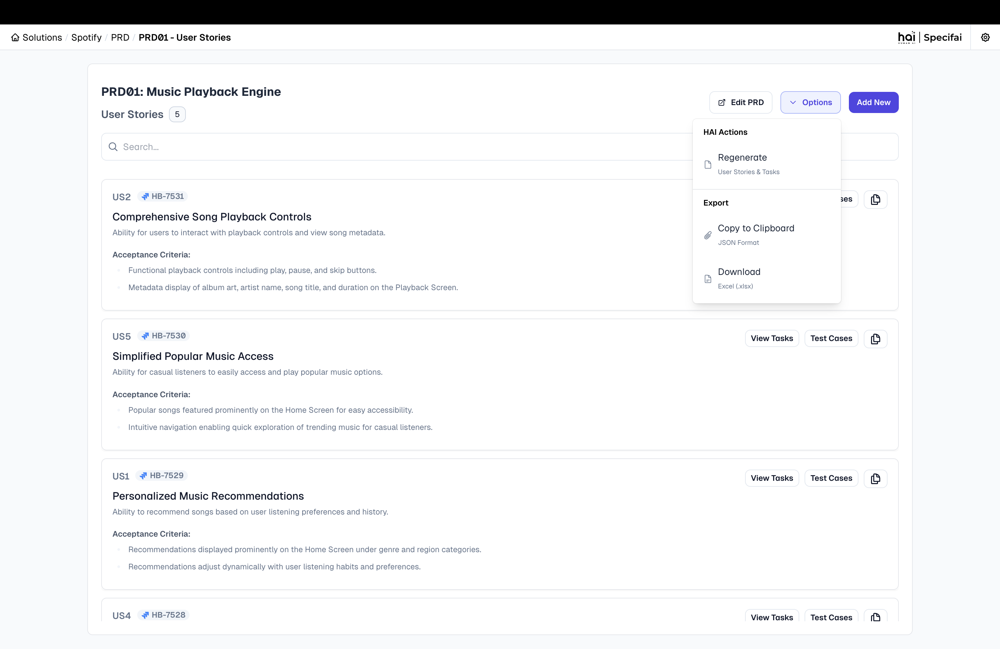

# Export & Integration Options 📤

Specifai provides seamless options to share and integrate your generated requirements with all stakeholders and development teams. This guide covers the various export and integration capabilities available.

## Export Options

### 1. Copy to Clipboard (JSON)
* Export requirements in JSON format.
* This option preserves the complete structure and relationships, ideal for developers and technical teams.
* **How to use**: 
  * Navigate to any requirement document
  * Click on the "Copy JSON" option in the export menu
  * The formatted JSON is now available to paste in any application

### 2. Excel Export
* Download requirements as structured spreadsheets.
* This includes all requirement details and metadata, perfect for stakeholder review and documentation.
* **How to use**:
  * Navigate to the requirement list view
  * Select the requirements you wish to export
  * Click the "Export to Excel" option
  * Save the generated spreadsheet to your preferred location

*Export interface for requirements and user stories*

---

## Integration Options

### 1. Jira Sync
Specifai provides robust bidirectional integration with Jira to synchronize your requirements and work items.

#### Features:
* **Push to Jira**: Send user stories, tasks, and requirements directly to Jira
* **Pull from Jira**: Import existing Jira items into Specifai
* **Maintain Hierarchy**: Preserve parent-child relationships between requirements
* **Field Mapping**: Configurable mapping between Specifai and Jira fields

#### How to Set Up:
1. Configure Jira connection in Settings
2. Authenticate with your Jira instance
3. Map project and issue types
4. Configure field mappings
5. Start synchronizing content

For detailed setup instructions, refer to our [Detailed JIRA Setup](JIRA-README.md) guide.

### 2. Azure DevOps Sync
Seamlessly synchronize your requirements with Azure DevOps projects.

#### Features:
* **Push to ADO**: Send requirements, user stories, and tasks to Azure DevOps
* **Pull from ADO**: Import existing work items from Azure DevOps
* **Hierarchical Structure**: Automatically creates Features, Platform Features, and User Stories with proper relationships
* **Customizable Field Mapping**: Map Specifai fields to your ADO instance configuration

#### How to Set Up:
1. Configure ADO connection in Settings
2. Authenticate with your Azure DevOps organization
3. Select the target project and work item types
4. Configure field mappings
5. Begin synchronization

For detailed setup instructions, refer to our [Detailed Azure DevOps Setup](ADO-README.md) guide.

---

## Best Practices for Integration

### 1. Regular Synchronization
* Set up a regular schedule for synchronizing requirements between Specifai and integrated systems
* Update Specifai before major planning sessions to ensure all systems reflect current state

### 2. Consistent Field Usage
* Establish conventions for field usage to ensure consistent mapping
* Document custom field mappings for team reference

### 3. Change Management
* Communicate to teams when large synchronizations will occur
* Consider the impact of bulk changes on notification systems in target platforms

### 4. Conflict Resolution
* Establish a process for resolving conflicts when items are modified in both systems
* Designate a system of record for specific fields or item types

---

## Integration Workflow Examples

### Agile Sprint Planning
1. Generate user stories in Specifai
2. Refine and enhance stories with AI assistance
3. Push selected stories to Jira/ADO for sprint planning
4. Update story points and assignments in Jira/ADO
5. Sync back to Specifai to maintain alignment

### Requirements Traceability
1. Create BRDs and PRDs in Specifai
2. Generate user stories from PRDs
3. Push to Jira/ADO with maintained relationships
4. Update implementation status in Jira/ADO
5. Pull status updates back to Specifai for executive reporting

---

For more information on creating and managing content in Specifai, see [Solution Creation & Management](solution-creation-management.md).
