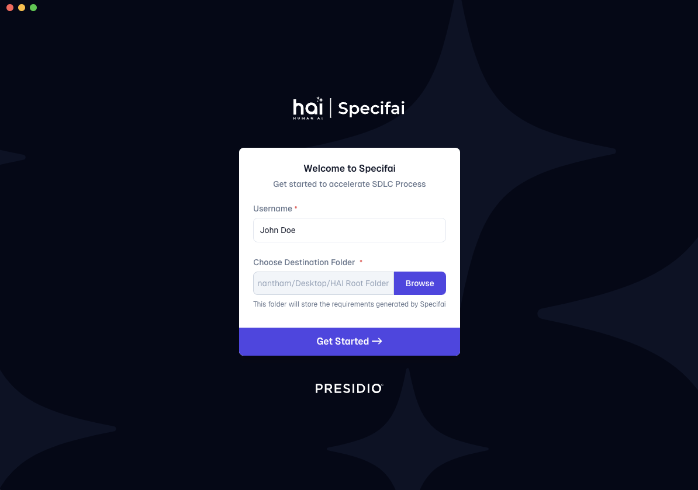

# Getting Started with Specifai 🚀

Welcome to Specifai - your AI-powered companion for revolutionizing the SDLC process! This guide will help you get up and running with Specifai, transforming how you manage project requirements.

## 📋 What You'll Learn

In this guide, you'll learn how to:
- Install Specifai on your system
- Perform initial configuration steps, including:
    - Setting up your user profile
    - Configuring your workspace
    - Connecting your preferred AI model
    - Adjusting optional settings like analytics
- Verify your Specifai installation
- Discover next steps to start building solutions

## 🔍 Before You Begin

### System Requirements
- Windows 10/11 or macOS 10.15+
- 4GB RAM minimum (8GB recommended)
- 1GB free disk space
- Internet connection for AI features

## 📥 Installation

### Download Latest Release (v2.7.0)

Choose your platform:
- **Windows**: [Download Specifai for Windows](https://github.com/presidio-oss/specif-ai/releases/download/v2.7.0/Specif-AI-Setup-2.7.0.exe)
- **macOS**: 
    - [Apple Silicon (M1/M2/M3)](https://github.com/presidio-oss/specif-ai/releases/download/v2.7.0/Specif-AI-2.7.0-arm64.dmg)
    - [Intel Processors](https://github.com/presidio-oss/specif-ai/releases/download/v2.7.0/Specif-AI-2.7.0.dmg)

> 💡 **Mac users**: Check your processor type in Apple Menu → About This Mac

View all versions on our [releases page](https://github.com/presidio-oss/specif-ai/releases).

### Quick Install Guide

#### Windows
1. Run the downloaded `.exe` file.
2. Follow the installation wizard.
3. Allow security permissions if prompted.

#### macOS
1. Open the `.dmg` file.
2. Drag Specifai to Applications.
3. Right-click and select "Open" (first time only).

## 🎯 Initial Setup

When you first launch Specifai, you'll see the welcome screen, guiding you through a quick setup process. Here's what you need to do:

### 1. User Profile
- Choose a username that identifies your work.
- Example: "john.doe" or "sarah.dev".

### 2. Workspace Setup

Choose a workspace directory that is:
- Easily accessible
- Has proper file permissions
- Has sufficient storage space
- Ideally synced with cloud storage (like oneDrive)

### 3. AI Model Configuration 🤖

1. Access **Settings** ⚙️ (top right corner).

2. Select AI model provider:
* **Anthropic**
    * claude-3-7-sonnet-20250219-v1:0
    * claude-3-5-sonnet-20241022-v2:0
    * claude-3-5-haiku-20241022-v1:0
    * claude-3-5-sonnet-20240620-v1:0
    * claude-3-opus-20240229-v1:0
    * claude-3-sonnet-20240229-v1:0
    * claude-3-haiku-20240307-v1:0
* **Azure OpenAI**
    * gpt-4o
    * gpt-4o-mini
* **OpenAI Native**
    * gpt-4o
    * gpt-4o-mini
* **AWS Bedrock**
    * anthropic.claude-3-7-sonnet-20250219-v1:0
    * anthropic.claude-3-5-sonnet-20241022-v2:0
    * anthropic.claude-3-5-haiku-20241022-v1:0
    * anthropic.claude-3-5-sonnet-20240620-v1:0
    * anthropic.claude-3-opus-20240229-v1:0
    * anthropic.claude-3-sonnet-20240229-v1:0
    * anthropic.claude-3-haiku-20240307-v1:0
* **Gemini**
    * gemini-2.0-flash-001
    * gemini-2.0-flash-lite-preview-02-05
    * gemini-2.0-pro-exp-02-05
    * gemini-2.0-flash-thinking-exp-01-21
    * gemini-2.0-flash-thinking-exp-1219
    * gemini-2.0-flash-exp
    * gemini-1.5-flash-002
    * gemini-1.5-flash-exp-0827
    * gemini-1.5-flash-8b-exp-0827
    * gemini-1.5-pro-002
    * gemini-1.5-pro-exp-0827
    * gemini-exp-1206
* **OpenRouter**
* **Ollama**

3. Enter model credentials.

4. Click "**Save**" to apply your model settings.

5. Connection verification:
    - Displays a success notification if the connection is established successfully.
    - If there's an error, check your credentials and internet connection.

### 4. Optional Settings

#### Analytics & Updates
- Enable/disable usage analytics to track the performance of Specifai.
- Configure automatic updates.
- Set up custom Langfuse analytics (optional).

#### Save Your Configuration
- Click "**Save**" to apply your changes.
- Verify settings are saved successfully.

## ✅ Verification Steps

Ensure your setup is complete by checking:
1. Specifai launches without errors.
2. Your chosen workspace is accessible.
3. The AI model connection is working correctly.
4. Analytics are configured as desired (if enabled).

## 🎉 Next Steps

You're ready to start using Specifai! Here's what to do next:

1.  **Create your first solution:**
    - Learn about solution structure.
    - Understand different requirement types.
    - Start documenting requirements.
    (See: [Core Features Guide](core-features.md#solution-creation))

2.  **Set up integrations:**
    - Configure Jira integration.
    - Configure Azure DevOps integration.
    - Set up AWS Bedrock.
    - Add custom MCP servers.
    (See: [Integrations Setup Guide](integrations-setup.md))

## 🆘 Quick Troubleshooting

Having issues? Check these common solutions:

1.  **Can't Start Application?**
    - Verify system requirements.
    - Check internet connection.
    - Run as administrator (Windows).

2.  **Workspace Issues?**
    - Verify folder permissions.
    - Choose a different location.
    - Close conflicting applications.

3.  **AI Model Problems?**
    - Verify credentials.
    - Check internet connection.
    - Confirm model availability.

Need more help?
- 📚 [Full Troubleshooting Guide](troubleshooting.md)
- 🐛 [GitHub Issues](https://github.com/presidio-oss/specif-ai/issues)
- 📧 Contact: hai-feedback@presidio.com

---

Specifai is designed to make your development process smoother and more efficient. Don't hesitate to reach out if you need help getting started!
