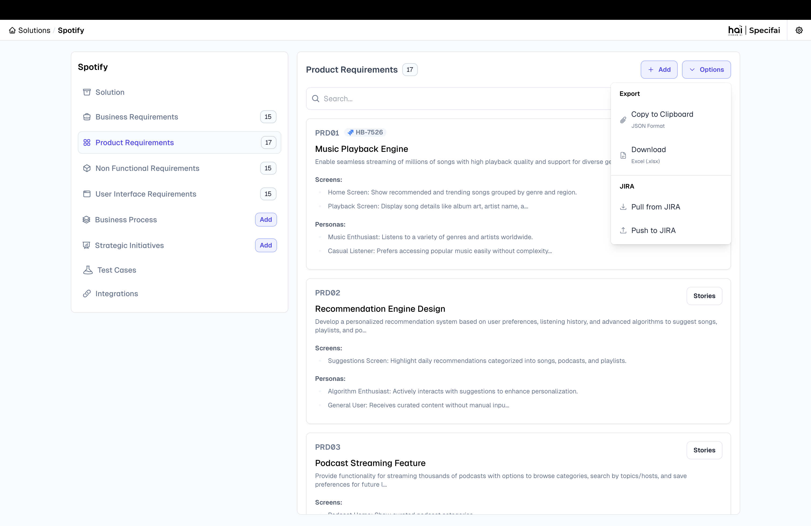
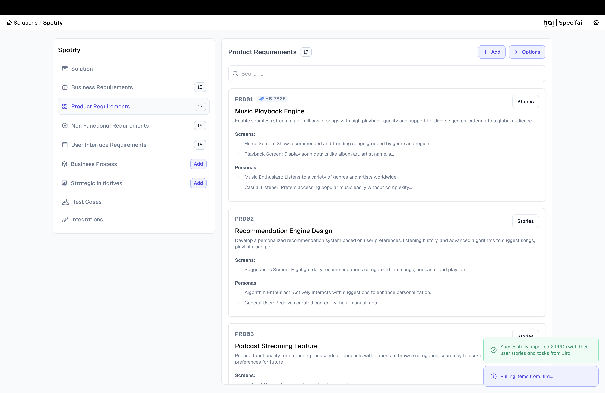
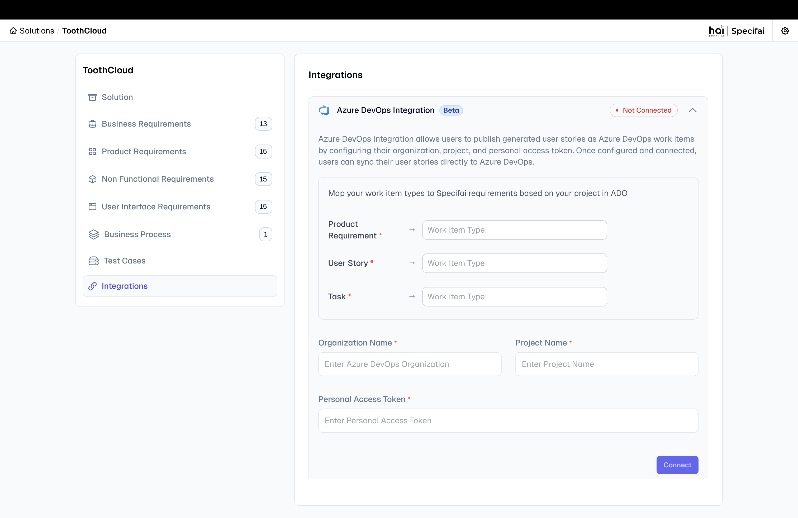
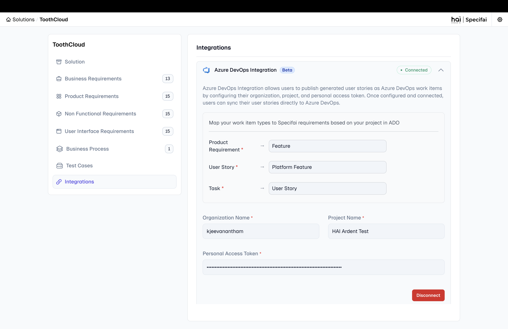

# Solution Integrations Setup Guide

Connect powerful external tools and services to enhance your Specifai workflows.

---

## 🎯 JIRA Integration

Integrate JIRA to transform Specifai-generated requirements into actionable JIRA tickets, streamlining your development pipeline.

<div align="center">


*Manage JIRA integrations within Specifai*

</div>

### ✨ Features and Benefits

* **Automated Ticket Creation:** Convert PRDs, User Stories, and Tasks into JIRA epics, stories, and tasks, maintaining hierarchy.
* **Bulk Export:** Export multiple stories and tasks at once, saving manual creation time.
* **Seamless Synchronization:** Create and update JIRA tickets based on Specifai changes, ensuring data consistency.

### ⚡ Quick Start Guide

1.  **Prerequisites:** You'll need an active JIRA instance, administrator access (or relevant permissions) to create JIRA OAuth apps, and the Specifai desktop application.

2.  **Detailed Setup:** For comprehensive OAuth configuration and permissions, refer to our [Jira OAuth 2.0 Integration Guide](JIRA-README.md).

3.  **Sync to JIRA:**
    * From the **PRD** page in Specifai, select your PRD and go to its **Stories** tab.
    * Click **Export** and choose **Sync to JIRA**.
        <div align="center">

        
        *Initiate sync to JIRA from the Export menu*

        </div>
    * Tickets are automatically created in JIRA with these mappings:
        * **Epic**: PRD
        * **Story**: User Story
        * **Task**: Task
    * You'll receive a notification upon sync completion. JIRA Ticket IDs are displayed in Specifai next to corresponding requirements for easy reference and search.
        <div align="center">

        
        *Synced JIRA tickets displayed in Specifai*

        </div>

---

## 🔷 Azure DevOps Integration

Integrate Azure DevOps to synchronize Specifai-generated requirements with your ADO work items, enabling seamless project management across platforms.

<div align="center">


*Manage Azure DevOps integrations within Specifai*

</div>

### ✨ Features and Benefits

* **Hierarchical Work Item Management:** Support for Features → Platform Features → User Stories mapping that aligns with ADO's structure.
* **Bidirectional Synchronization:** Pull work items from ADO into Specifai or push Specifai requirements to ADO.
* **Flexible Mapping:** Configure work item types to match your ADO project structure (PRD→Feature, User Story→Platform Feature, Task→User Story).
* **Bulk Operations:** Import or export multiple work items efficiently, maintaining parent-child relationships.
* **Personal Access Token Authentication:** Secure authentication using Azure DevOps PATs with granular permission control.

### ⚡ Quick Start Guide

1. **Prerequisites:** You'll need an active Azure DevOps organization, project access with work item permissions, and the Specifai desktop application.

2. **Detailed Setup:** For comprehensive PAT creation and configuration, refer to our [Azure DevOps Integration Guide](ADO-README.md).

3. **Pull from Azure DevOps:**
   * Navigate to your solution's integration page in Specifai.
   * Click **Sync with Azure DevOps** to access the ADO integration modal.
   * Select the Features, Platform Features, and User Stories you want to import.
   * Click **Pull from ADO** to import selected items into Specifai as PRDs, User Stories, and Tasks.

4. **Push to Azure DevOps:**
   * From your solution, select the PRDs, User Stories, and Tasks you want to export.
   * Click **Push to ADO** to create corresponding work items in Azure DevOps.
   * The system maintains hierarchical relationships (PRD→Feature, User Story→Platform Feature, Task→User Story).

5. **Successful Integration:**
   * Upon successful sync, you'll see confirmation messages and ADO work item IDs displayed in Specifai.
   * Work items maintain bidirectional references for easy tracking and updates.
   
   <div align="center">

   
   *Successfully connected Azure DevOps integration*

   </div>

---

## 🚀 AWS Bedrock Knowledge Base Direct Solution Integration

Connect your enterprise knowledge base to Specifai's AI chat, enhancing suggestions and enabling context-aware requirement generation for all document types.

### ✨ Benefits & Features

* **Enhanced Chat Suggestions:** Leverage organizational knowledge for insightful AI chat assistance.
* **Context-Aware Generation:** Create precise requirements using context from your knowledge base (e.g., domain info).
* **Historical Data Integration:** Integrate past data (e.g., previous requirements) for informed creation.

### 🛠 Setup Instructions

1.  **Prerequisites:** You'll need an AWS Knowledge Base containing relevant context (domain info, past requirements) and an IAM key with `bedrock:ListKnowledgeBases`, `bedrock:GetKnowledgeBase`, `bedrock:Retrieve` permissions.
    <div align="center">

    
    *Configure your AWS Bedrock Knowledge Base connection*

    </div>

2.  **Existing Bedrock LLM Config (Optional):** If your existing AWS Bedrock LLM configuration has the necessary permissions, simply check **"Use existing Bedrock configuration from LLM settings"**.

3.  **Direct API Key Config:** Alternatively, configure AWS API Keys directly using the provided form fields.

4.  **Knowledge Base ID:** Accurately enter your AWS Knowledge Base ID.

5.  **Connect:** Click "**Connect**" to establish the link between Specifai and your AWS Knowledge Base.

### ✅ Verification Steps

* **Verify KB Access:** Confirm Specifai can access and retrieve data from your AWS KB.
* **Test Chat Suggestions:** Verify AI chat suggestions are enhanced and relevant, drawing from the KB.

---

## 🧠 Model Context Protocol (MCP) Integration

**MCP** is Specifai's extensible framework for integrating external tools and knowledge bases. It enhances AI relevance and accuracy for all generated requirements.

<div align="center">
    *Supercharge your development workflow with powerful tools and knowledge bases through the flexible Model Context Protocol (MCP)*
</div>

### 🛠 Built-in MCP Server Integration

Specifai natively supports **AWS Bedrock Knowledge Base (KB)** as a built-in MCP server, leveraging your organizational data for requirements. Configuration is straightforward via the UI. For detailed setup, refer to our [AWS Bedrock KB Configuration Guide](aws-bedrock-kb-configuration.md).

<div align="center">


*Interface for AWS Bedrock KB configuration*

</div>

### 🛠 Custom MCP Server Integration

Beyond built-in options, Specifai enables custom MCP server integration, extending functionality with proprietary data or specialized applications (e.g., a file system MCP server).

#### Configuring Custom MCP Servers

1.  **Navigate to MCP Integrations:** Access **MCP Integrations** during **Solution Creation** or in **Settings > Integrations**.

    <div align="center">

    
    *Access MCP server integrations during solution creation*

    </div>

    ---

    <div align="center">

    
    *Manage MCP server integrations for an existing solution*

    </div>

    ---

2.  **Add New MCP Server:** From the **"MCP Integrations"** tab, select **"New MCP Server"**.

3.  **Provide Details:**
    * **Server ID:** A unique identifier (e.g., `filesystem`).
    * **Server Configuration (JSON):** Define communication parameters.
        ```json
        {
          "command": "npm",
          "transportType": "stdio",
          "args": ["run", "@modelcontextprotocol/server-filesystem", "/your/path/to/Mcp"],
          "id": "filesystem"
        }
        ```

    <div align="center">

    
    *Interface for configuring custom MCP server integrations*

    </div>

4.  **Validate & Submit:** Click "**Validate**" to confirm connectivity, then "**Submit**" to save.

5.  **Save Integration:** Click "**Save**" to finalize the integration.

---

### 🌐 Centralized Integration Management

All MCP integrations are managed from a single **Integrations** page, providing a unified hub to add, configure, monitor, and remove servers.

<div align="center">


*Manage all MCP integrations from a single, centralized location*

</div>

---

### 💡 How MCP Enhances Requirement Workflows

MCP tools are dynamically invoked during the **research step** within Specifai's agentic workflows, gathering crucial information that directly impacts output quality.

MCP specifically enhances:

1.  **Solution Generation:** Improves **BRD, PRD, NFR, and UIR** accuracy by providing contextual information.
2.  **User Story & Task Generation:** Contributes to the research phase for relevant and actionable **User Stories and Tasks**.
3.  **AI Chat Assistance:** Refines **AI chat suggestions** with real-time contextual information.

---

## Next Steps
Now that you've set up your integrations, you're ready to enhance your Specifai experience! Explore the following:
* **[Advanced Features Guide](advanced-features.md)** for deeper insights into Specifai's capabilities.
* **[Troubleshooting Guide](troubleshooting.md)** for common issues and solutions.
---

Need more help?
* Contact us at [hai-feedback@presidio.com](mailto:hai-feedback@presidio.com)
* Visit our [GitHub Issues](https://github.com/presidio-oss/specif-ai/issues) page.

Specifai is continuously evolving—check our [release notes](https://github.com/presidio-oss/specif-ai/releases) for updates!
