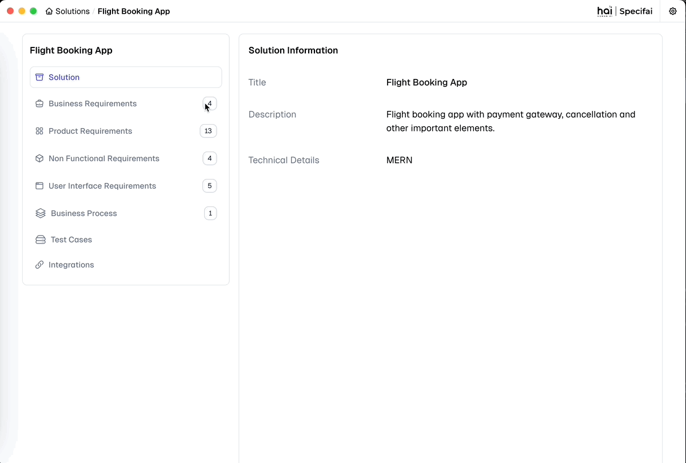
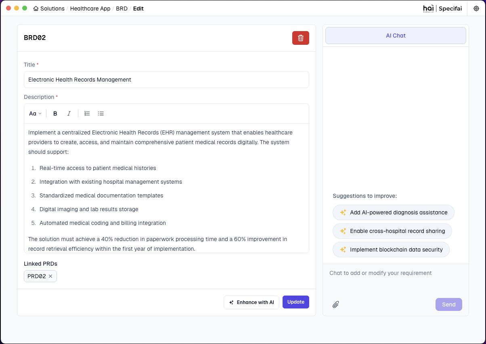
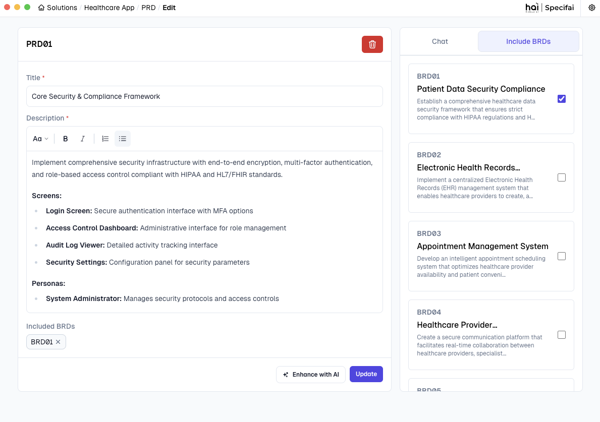
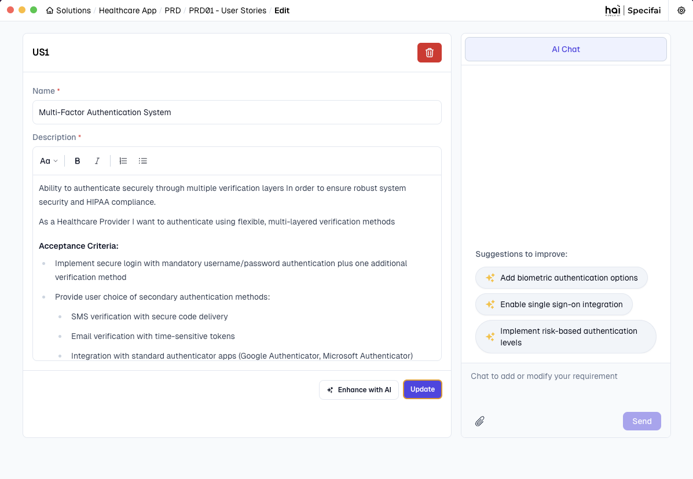
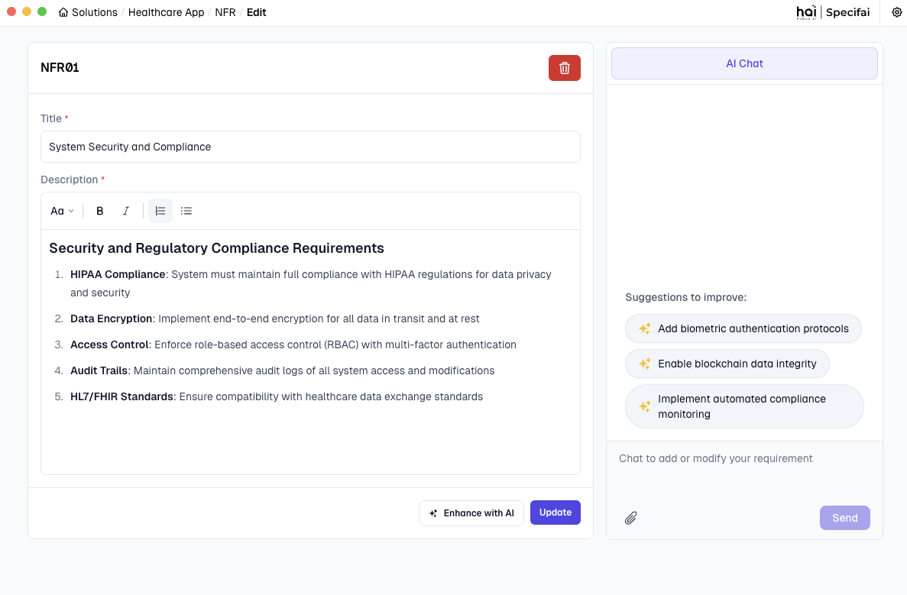
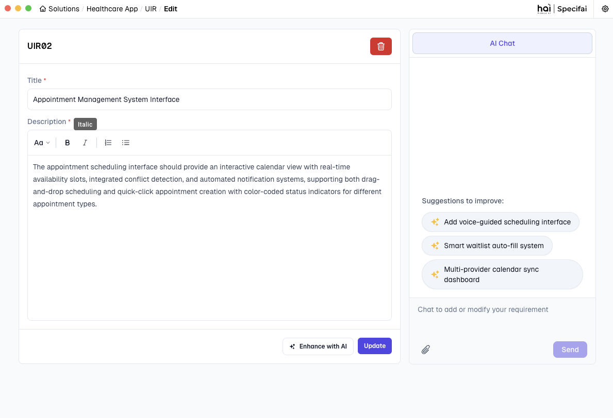
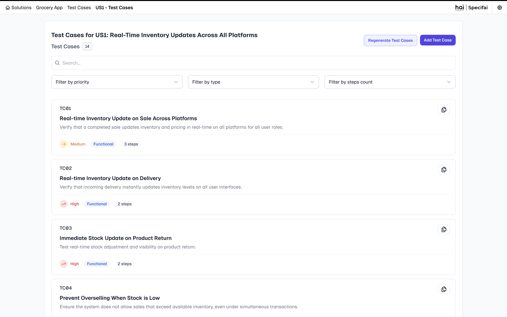
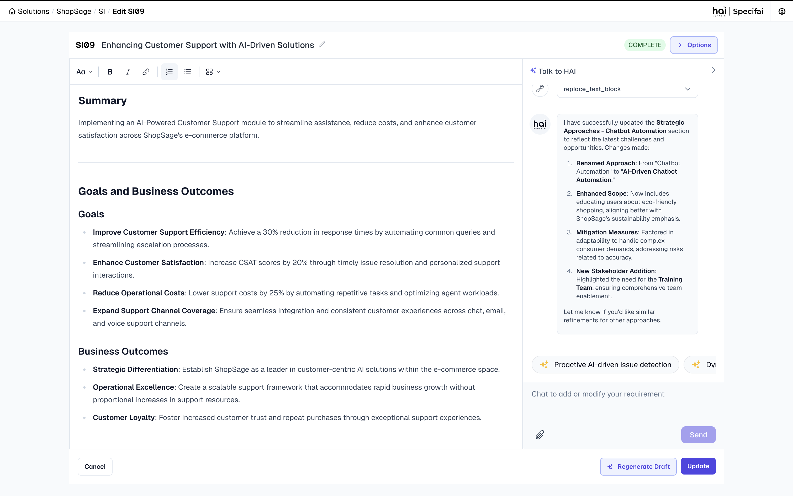

# Requirements Document Types and Best Practices 📝

Specifai streamlines the creation of essential SDLC documents through AI-powered generation and intuitive management. This guide explains the various document types available in Specifai and best practices for each.

<div align="center">


*AI-powered document generation workflow*

</div>

## 1. Business Requirements (BRD)

### What is a BRD?
A **Business Requirements Document (BRD)** is a formal document that describes the business solution for a project. It includes the user's needs and expectations, the product's purpose and objectives, and any high-level constraints or dependencies. It serves as a bridge between business objectives and technical implementation, ensuring all stakeholders have a clear understanding of what needs to be achieved.

### Best Practices for Writing BRDs
* Start with a clear business objective.
* Include stakeholder impact analysis.
* Define measurable success criteria.
* Specify regulatory/compliance requirements.
* Document assumptions and constraints.
* Include a cost-benefit analysis.
* Reference related industry standards.
* Maintain traceability to business goals.

### Example BRD
<div align="center">


*Business Requirements Document interface in Specifai*

</div>

## 2. Product Requirements (PRD)

### What is a PRD?
A **Product Requirements Document (PRD)** is a technical document that outlines the specific requirements, features, and functionalities of a product or system. It translates business requirements into detailed technical specifications that guide development teams in implementing the solution effectively. **PRDs can be linked to relevant BRDs** to ensure alignment between business needs and technical implementation.

### Best Practices for Writing PRDs
* Define system interfaces and integration points.
* Specify data models and state transitions.
* Document error scenarios and recovery paths.
* Include performance SLAs and scalability targets.

### Example PRD

<div align="center">


*Product Requirements Document interface in Specifai*

</div>

## 3. User Stories (US)

### What are User Stories?
**User Stories** are concise descriptions of functionality from an end user's perspective. They capture what users want to achieve, why they want it, and what value it brings to them. User stories help teams understand the user's needs and expectations.

### Best Practices for Writing User Stories
* Link to specific business capabilities.
* Include technical dependencies and constraints.
* Define clear validation criteria.
* Specify data requirements and state changes.
* **Story Format**:
    ```
    As a [user type]
    I want to [action]
    So that [benefit]
    ```

### Example User Story

<div align="center">


*User Story details interface in Specifai*

</div>

## 4. Tasks

### What are Tasks?
**Tasks** are specific, actionable items that break down the implementation of user stories into manageable pieces of work. They represent the technical steps needed to deliver the functionality described in user stories.

### Best Practices for Writing Tasks
* Define technical acceptance criteria.
* Specify test scenarios and edge cases.
* Document system dependencies.
* Include rollback procedures.

### Example Task

<div align="center">


*Task details interface in Specifai*

</div>

## 5. Non-Functional Requirements (NFR)

### What are NFRs?
**Non-Functional Requirements (NFRs)** define the quality attributes and operational characteristics of a system. Unlike functional requirements that specify what the system should do, NFRs describe *how* the system should perform, focusing on criteria that can be used to judge the system's operation rather than specific behaviors.

### Best Practices for Writing NFRs
* Define quantifiable metrics for each requirement.
* Specify monitoring and alerting thresholds.
* Document compliance validation methods.
* Include performance test scenarios.

### Example NFR

<div align="center">


*Non-Functional Requirements interface in Specifai*

</div>

## 6. User Interface Requirements (UIR)

### What are UIRs?
**User Interface Requirements (UIRs)** define the visual, interactive, and experiential aspects of a system's user interface. They ensure consistency in design, optimal user experience, and adherence to brand guidelines while maintaining accessibility and usability standards.

### Best Practices for Writing UIRs
* Define component-specific accessibility requirements.
* Document responsive breakpoints and behaviors.
* Specify interaction states and transitions.
* Include performance metrics for UI components.

### Example UIR

<div align="center">


*User Interface Requirements interface in Specifai*

</div>

## 7. Test Cases (TC)

### What are Test Cases?
**Test Cases** are detailed procedures designed to verify that a specific aspect of the system functions as expected. They provide a structured approach to validate requirements, identify defects, and ensure quality across the application.

### Best Practices for Writing Test Cases
* Link directly to requirements for traceability.
* Include clear prerequisites and setup steps.
* Define specific input data and expected outcomes.
* Document edge cases and boundary conditions.
* Specify pass/fail criteria.
* Include both positive and negative test scenarios.

### Example Test Case Structure
```
Test Case ID: TC01
User Story ID: US05
Description: Verify user login with valid credentials
Prerequisites:
  - User account exists in the system
  - User is not currently logged in
Steps:
  1. Navigate to login page
  2. Enter valid username
  3. Enter valid password
  4. Click login button
Expected Result: User is successfully logged in and redirected to dashboard
Alternative Flows:
  - If remember me is checked, session should persist after browser restart
```

### Example TC

<div align="center">


*Test Cases in Specifai*

</div>

## 8. Strategic Initiatives (SI)

### What are Strategic Initiatives?
**Strategic Initiatives** represent high-level organizational objectives that drive multiple solutions or projects. They align technical efforts with business goals and provide context for requirement prioritization across the enterprise portfolio.

### Best Practices for Strategic Initiatives
* Define clear business outcomes and success metrics.
* Include executive sponsorship and stakeholder information.
* Outline alignment with company vision and mission.
* Document dependencies on other initiatives.
* Establish timeline and milestone expectations.
* Identify key performance indicators (KPIs) for measuring success.
* **Add Research URLs**: Enhance initiatives with links to external research, documentation, and context.

### Strategic Initiative Components
* **Vision Statement**: The overarching goal of the initiative.
* **Business Drivers**: Factors necessitating the initiative.
* **Success Criteria**: Measurable outcomes that determine success.
* **Solution Portfolio**: Collection of solutions supporting the initiative.
* **Timeline**: Major milestones and delivery expectations.
* **Research Resources**: External URLs and documentation that provide additional context and support for the initiative.

### Example SI

<div align="center">


*Strategic Initiative in Specifai*

</div>

---

Want to learn more about generating and managing these requirements? Check out:
- [Solution Creation & Management](solution-creation-management.md) for information on creating and organizing requirements
- [AI-Generated Content](ai-generated-content.md) for details on automating the creation of these documents
