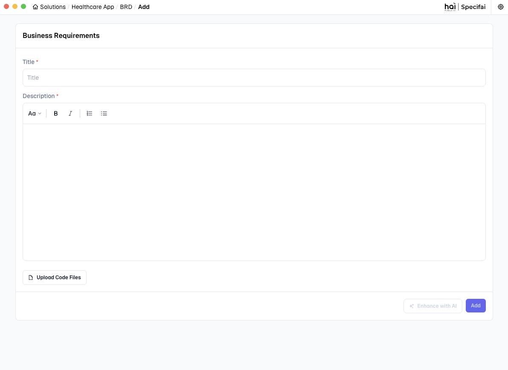
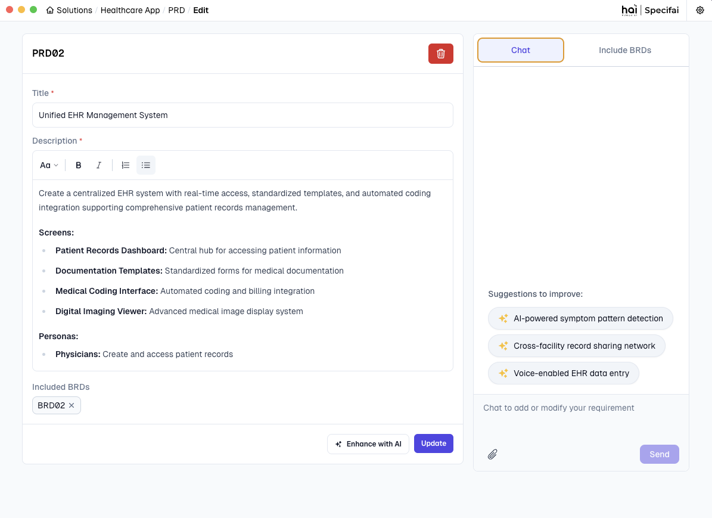

# Solution Creation & Management 🎯

This guide walks you through creating, structuring, and managing solutions in Specifai.

## 🎯 Solution Creation

### Creating Your First Solution
<div align="center">


*Transform your ideas into well-structured solutions in minutes*

</div>

1.  **Launch Solution Creation:**
    * Click the "**New Solution**" button on your dashboard.
    * > **Pro tip:** Keep the dashboard organized by using clear naming conventions.

2.  **Define Solution Details:**
    * **Solution Name**: Choose a clear, descriptive name.
        * **Good example:** "Task-Management-System"
        * **Avoid:** Generic names like "New Project."
    * **Description**: Provide comprehensive context.
        * Include business objectives, key stakeholders, and primary goals.
        * Mention any third-party integrations or compliance requirements.
    * **Technical Stack**: Specify your technology choices, such as:
        * **Frontend frameworks** (e.g., React, Angular)
        * **Backend technologies** (e.g., Node.js, Java)
        * **Databases** (e.g., PostgreSQL, MongoDB)
        * **Infrastructure** (e.g., AWS, Azure)
    * **Is solution built already?**: Configure requirement generation preferences using this toggle.
        * **When enabled:** No requirements will be automatically generated, giving users more control over requirement creation.
        * **When disabled:** Specifai starts fresh with new requirement generation based on the provided context.

3.  **Configure Solution Preferences:**
    Set the minimum number of requirements (default: 15) to be generated for BRD, PRD, UIR, and NFR types. Adjust this based on your project's scope.

4.  **MCP Integration Setup:**
    Enhance your solution with Model Context Protocol (MCP) servers:
    * **AWS Bedrock KB:**
        * Connect to an AWS Bedrock Knowledge Base.
        * Leverage enterprise knowledge for better context.
        * Enable advanced AI capabilities.
    * **Custom MCP Server:**
        * Add new MCP servers for extended functionality.
        * Configure custom integrations and access additional AI models and tools.
    * For detailed setup, refer to our [MCP Integration Guide](integrations-setup.md#-model-context-protocol-mcp-integration).

5.  **Create Solution Space:**
    * Click "**Create**" to initialize your solution with requirements and MCP configurations.
    * Watch as Specifai sets up your workspace with AI-powered intelligence.

### Understanding Solution Structure
Each solution follows a modular, scalable structure:

```
📁 Solution Root Folder
├── 📄 .metadata.json            # Solution configuration
├── 📁 BRD                       # Business Requirements
│   ├── 📄 BRD01-base.json
│   └── 📄 BRDxx-base.json
├── 📁 NFR                       # Non-Functional Requirements
│   ├── 📄 NFR01-base.json
│   └── 📄 NFRxx-base.json
├── 📁 PRD                       # Product Requirements
│   ├── 📄 PRD01-base.json
│   ├── 📄 PRD01-feature.json    # User Stories & Tasks
│   ├── 📄 PRDxx-base.json
│   └── 📄 PRDxx-feature.json
├── 📁 UIR                       # User Interface Requirements
│   ├── 📄 UIR01-base.json
│   └── 📄 UIRxx-base.json
├── 📁 TC                        # Test Cases
│   ├── 📁 US1                   # Test Cases for User Story 1
│   │   ├── 📄 TC01-base.json
│   │   └── 📄 TCxx-base.json
│   └── 📁 USx                   # Test Cases for User Story x
│       ├── 📄 TC01-base.json
│       └── 📄 TCxx-base.json
├── 📁 SI                        # Strategic Initiatives
│   ├── 📄 SI01-base.json
│   └── 📄 SIxx-base.json
└── 📁 BP                        # Business Process Flows
    ├── 📄 BP01-base.json
    └── 📄 BPxx-base.json
```

#### Key Components

1.  **🔖 Metadata Configuration (`.metadata.json`)**
    This file stores essential solution details:
    * Solution name and description
    * Technical stack details
    * Creation and modification timestamps
    * MCP Tools configuration

2.  **📑 Document Folders**
    Each folder contains specific requirement types:
    * **BRD**: Business objectives & stakeholder needs.
    * **PRD**: Technical specs & implementation details.
    * **User Stories**: Actionable items from PRD.
    * **Tasks**: Breakdown of user stories.
    * **NFR**: Performance & security requirements.
    * **UIR**: UI/UX design guidelines.
    * **TC**: Test cases for quality validation procedures.
    * **SI**: Strategic initiatives for high-level organizational objectives.

3.  **📊 Business Process Flows (`BP`)**
    This folder contains visual representations of your key business processes.

---

## ✍️ Organizing and Refining Your Requirements

Once your initial documents are generated, Specifai provides robust tools to organize and refine your requirements.

### 1. Adding Requirements
* **Fill in Basic Details:**
    * **Title**: Write a clear, descriptive title that reflects the requirement's purpose.
    * **Description**: Provide comprehensive details about functionality, constraints, and goals.
    * **Code References**: Upload relevant code files to provide implementation context.
* **Enhance with AI:**
    * Click the "**Enhance with AI**" button to improve requirement quality.
    * Requirements are automatically saved when enhanced.
* Use the "**Add**" button to create the new requirement.

<div align="center">


*Interface for adding a requirement (e.g., a BRD)*

</div>

### 2. Updating Requirements
* **Select and Modify:**
    * Click any requirement to open it for editing.
    * Update the title and description as needed. Changes are auto-saved as you type.
* **AI Enhancement:**
    * Use "**Enhance with AI**" to improve existing content.
    * Review and apply AI suggestions as needed from the AI Chat Interface on the right side of the screen.

<div align="center">


*Updating a requirement with AI assistance*

</div>

> 💡 **Pro Tip:** Use the AI chat interface for real-time suggestions and improvements when updating requirements.

### 3. Deleting Requirements
* **Remove Requirements:**
    * Click the "**Delete**" button on any requirement.
    * Confirm deletion in the verification dialog.
    * Requirements are soft-deleted for safety.
* **Archival System:**
    * Deleted requirements are stored in the HAI Solution Folder.
    * Full history and relationships are preserved, allowing you to recover deleted requirements when needed.

---

## 🧠 Model Configuration

Specifai offers flexible AI model configuration, allowing you to choose and connect to various powerful language models to best suit your project's needs.

> For detailed setup instructions, refer to our [Getting Started Guide](getting-started.md#3-ai-model-configuration-).

<div align="center">


*Easily configurable multi-provider AI model support*

</div>

---

## 🎉 Next Steps

Ready to explore more with Specifai?
1.  Set up [integrations](integrations-setup.md) with your existing tools to connect your workflows.
2.  Discover [advanced features](advanced-features.md) for power users who want to push Specifai to its limits.
3.  Join our [community](https://github.com/presidio-oss/specif-ai/discussions) to ask questions, share feedback, and connect with other users.

---

Need help? Check our [troubleshooting guide](troubleshooting.md) for quick solutions, or reach out to [support](mailto:hai-feedback@presidio.com) if you have any questions.

Specifai is continuously evolving to meet your needs—be sure to check our [release notes](https://github.com/presidio-oss/specif-ai/releases) for the latest features and improvements!
