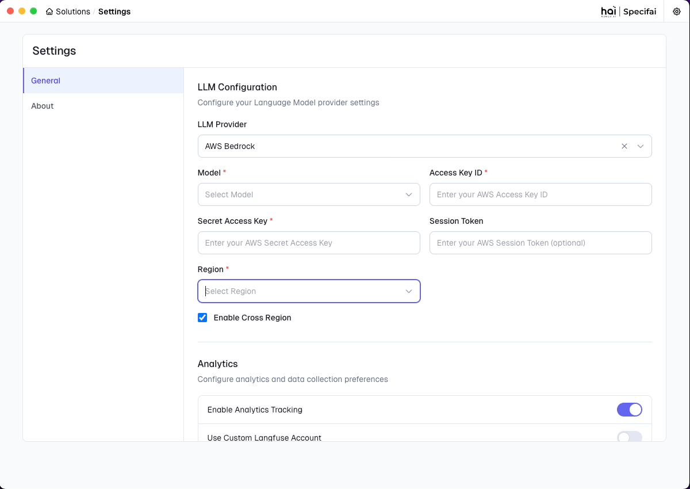

# Getting Started with Specifai 🚀

Welcome to Specifai - your AI-powered companion for revolutionizing the SDLC process! This guide will help you get up and running with Specifai, transforming how you manage project requirements.

## 📋 What You'll Learn

In this guide, you'll learn how to:
- Install and configure Specifai
- Set up your workspace
- Configure your AI model preferences
- Start creating your first solution

## 🔍 Before You Begin

### System Requirements
- Windows 10/11 or macOS 10.15+
- 4GB RAM minimum (8GB recommended)
- 1GB free disk space
- Internet connection for AI features

## 📥 Installation

### Download Latest Release

Choose your platform:
- **Windows**: [Download Specifai for Windows](https://github.com/presidio-oss/specif-ai/releases/download/v2.4.0/Specif-AI-Setup-2.4.0.exe)
- **macOS**: [Download Specifai for macOS](https://github.com/presidio-oss/specif-ai/releases/download/v2.4.0/Specif-AI-2.4.0-arm64.dmg)

View all versions on our [releases page](https://github.com/presidio-oss/specif-ai/releases/tag/v2.4.0).

### Quick Install Guide

#### Windows
1. Run the downloaded `.exe` file
2. Follow the installation wizard
3. Allow security permissions if prompted

#### macOS
1. Open the `.dmg` file
2. Drag Specifai to Applications
3. Right-click and select "Open" (first time only)

## 🎯 Initial Setup

When you first launch Specifai, you'll see the welcome screen:

### 1. Quick Setup Checklist

- [ ] Create user profile
- [ ] Configure workspace
- [ ] Set up AI model
- [ ] Configure analytics (optional)
- [ ] Verify installation

### 2. User Profile
- Choose a username that identifies your work
- Example: "john.doe" or "sarah.dev"

### 3. Workspace Setup

Choose a workspace directory that is:
- Easily accessible
- Has proper file permissions
- Has sufficient storage space
- Ideally synced with cloud storage (like oneDrive)

### 4. AI Model Configuration 🤖

1. Access Settings ⚙️ (top right corner)

2. Choose your preferred AI model:
   - Anthropic
   - Azure OpenAI
   - OpenAI Native
   - AWS Bedrock
   - Gemini
   - OpenRouter
   - Ollama

3. Enter your model credentials

> 💡 For detailed model options and configurations, see our [Advanced Features Guide](advanced-features.md#model-configuration).

### 5. Optional Settings

#### Analytics & Updates
- Enable/disable usage analytics to track the performance of Specifai  
- Configure automatic updates
- Set up custom Langfuse analytics (optional)

#### Save Your Configuration
- Click "Save" to apply changes
- Verify settings are saved successfully

## ✅ Verification Steps

Ensure your setup is complete by checking:
1. Specifai launches without errors
2. Workspace is accessible
3. AI model connection is working
4. Analytics are configured (if enabled)

## 🎉 Next Steps

You're ready to start using Specifai! Here's what to do next:

1. [Create your first solution](core-features.md#solution-creation-and-management)
   - Learn about solution structure
   - Understand different requirement types
   - Start documenting requirements

2. [Set up integrations](integrations-setup.md)
   - Configure Jira integration
   - Set up AWS Bedrock
   - Add custom MCP servers

3. [Explore AI features](core-features.md#ai-powered-document-generation)
   - Try AI-powered document generation
   - Use the intelligent chat interface
   - Generate user stories and tasks

## 🆘 Quick Troubleshooting

Having issues? Check these common solutions:

1. **Can't Start Application?**
   - Verify system requirements
   - Check internet connection
   - Run as administrator (Windows)

2. **Workspace Issues?**
   - Verify folder permissions
   - Choose a different location
   - Close conflicting applications

3. **AI Model Problems?**
   - Verify credentials
   - Check internet connection
   - Confirm model availability

Need more help? 
- 📚 [Full Troubleshooting Guide](troubleshooting.md)
- 🐛 [GitHub Issues](https://github.com/presidio-oss/specif-ai/issues)
- 📧 Contact: hai-feedback@presidio.com

---

Remember: Specifai is designed to make your development process smoother and more efficient. Don't hesitate to reach out if you need help getting started!
