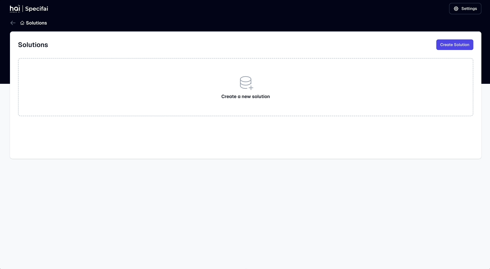

# Specifai Documentation 🚀

Welcome to Specifai - your AI-powered companion for revolutionizing project requirements management! This comprehensive guide will help you master all features of Specifai and transform your SDLC process.

## 🚀 Quick Star

- [Getting Started Guide](getting-started.md) - Set up and configure Specifai
- [Core Features](core-features.md) - Learn about the main capabilities
- [Integrations Setup](integrations-setup.md) - Configure external integrations
- [Advanced Features](advanced-features.md) - Explore advanced capabilities
- [Troubleshooting & FAQs](troubleshooting.md) - Resolve common issues

## ✨ Key Features

- 🤖 AI-Powered Document Generation
- 📊 Business Process Visualization
- 📝 Comprehensive Requirements Management
- 🔄 Version Control Integration
- 🔌 Extensible through MCP
- 🔗 Jira Integration
- ☁️ AWS Bedrock Knowledge Base

## 📚 Documentation Structure

### 1. [Getting Started](getting-started.md)
- Installation and Setup
- Initial Configuration
- Workspace Setup
- Basic Navigation

### 2. [Core Features](core-features.md)
- Solution Creation
- Document Generation
- Requirements Management
- User Stories & Tasks
- Model Configuration

### 3. [Integrations Setup](integrations-setup.md)
- Jira Integration
- AWS Bedrock KB
- MCP Configuration
- Custom Server Setup

### 4. [Advanced Features](advanced-features.md)
- Agentic Solution Generation
- Multi-Model Support
- Analytics & Observability
- BRD-PRD Linking
- Custom Templates
- Version Control

### 5. [Troubleshooting & FAQs](troubleshooting.md)
- Common Issues
- Performance Optimization
- Best Practices
- Support Resources

## 🔗 Additional Resources

- [GitHub Repository](https://github.com/presidio-oss/specif-ai)
- [Release Notes](https://github.com/presidio-oss/specif-ai/releases)
- [Contributing Guidelines](https://github.com/presidio-oss/specif-ai/blob/main/CONTRIBUTING.md)
- [License Information](https://github.com/presidio-oss/specif-ai/blob/main/LICENSE)

## 🤝 Support

Need help? We're here for you:
- 📧 Email: hai-feedback@presidio.com
- 🐛 [GitHub Issues](https://github.com/presidio-oss/specif-ai/issues)
- 💡 [Feature Requests](https://github.com/presidio-oss/specif-ai/discussions)

## 🎯 Solution Examples

Recent solutions in our community:
- Healthcare Applications
- E-commerce Platforms
- Task Management Systems
- Cloud Services
- Mobile Applications

Each solution follows our structured approach to requirements management, ensuring consistency and completeness across your projects.

## 🌟 Best Practices

1. **Solution Organization**
   - Use descriptive solution names
   - Maintain consistent documentation
   - Regular synchronization with version control

2. **Document Management**
   - Follow BRD numbering convention
   - Keep metadata up to date
   - Link related requirements

3. **Collaboration**
   - Share solution access appropriately
   - Use version control features
   - Maintain documentation standards

Remember: Specifai is designed to make your development process smoother and more efficient. Our organized structure ensures you can focus on what matters most - building great solutions!
