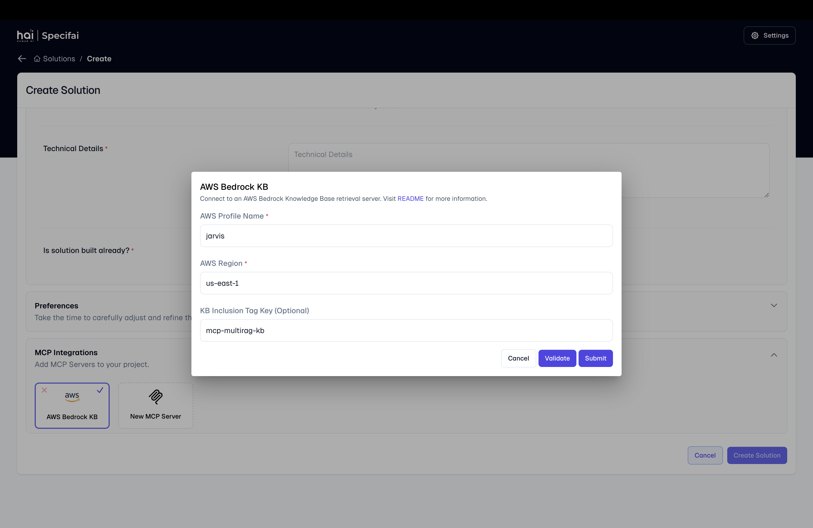

# Integrations Setup Guide 🔌

Welcome to the Specifai integrations guide! Here you'll learn how to supercharge your Specifai experience by connecting powerful tools and services. Let's make your requirements management even more efficient!

## 🔄 Model Context Protocol (MCP)



The Model Context Protocol (MCP) is Specifai's powerful integration framework that enhances your workflow with external tools and knowledge bases.

### Benefits of MCP Integration

1. **Enhanced Context Understanding**
   - Access enterprise knowledge bases
   - Leverage domain-specific tools
   - Integrate custom data sources

2. **Workflow Automation**
   - Automate repetitive tasks
   - Connect to external systems
   - Streamline document generation

3. **Custom Tool Integration**
   - Add specialized capabilities
   - Create custom workflows
   - Extend Specifai's functionality

### Setting Up Custom MCP Servers

1. **Access MCP Settings**
   ```bash
   # Navigate to:
   Settings → Integrations → Add Custom Server
   ```

2. **Server Configuration**
   ```json
   {
     "name": "Your Custom Server",
     "url": "https://your-server-url.com",
     "auth": {
       "type": "bearer",
       "token": "your-auth-token"
     }
   }
   ```

3. **Verify Connection**
   - Test server connectivity
   - Validate available tools
   - Check resource access

## 🤖 AI Model Configuration

### Azure OpenAI Setup

1. **Prerequisites**
   - Active Azure subscription
   - Azure OpenAI service access
   - API credentials

2. **Configuration Steps**
   ```bash
   # Navigate to:
   Settings → AI Models → Azure OpenAI
   ```

3. **Required Details**
   ```json
   {
     "endpoint": "https://your-resource.openai.azure.com/",
     "apiKey": "your-api-key",
     "deploymentName": "your-deployment",
     "apiVersion": "2024-02-15-preview"
   }
   ```

### AWS Bedrock Integration


1. **AWS Setup**
   ```bash
   # Install AWS CLI
   brew install awscli  # macOS
   choco install awscli # Windows
   
   # Configure AWS
   aws configure --profile specifai
   ```

2. **Bedrock Configuration**
   - Region selection
   - Model access setup
   - API limits configuration

3. **Knowledge Base Setup**
   ```json
   {
     "profile": "specifai",
     "region": "us-east-1",
     "tagKey": "specif-mcp-rag-kb",
     "modelId": "anthropic.claude-3-sonnet"
   }
   ```

### Gemini Setup

1. **Google Cloud Setup**
   - Create Google Cloud project
   - Enable Gemini API
   - Generate API credentials

2. **Configuration**
   ```json
   {
     "projectId": "your-project-id",
     "apiKey": "your-api-key",
     "location": "us-central1",
     "modelName": "gemini-2.0-pro"
   }
   ```

### OpenRouter/Ollama Configuration

1. **OpenRouter Setup**
   ```json
   {
     "apiKey": "your-api-key",
     "modelName": "preferred-model",
     "baseUrl": "https://openrouter.ai/api"
   }
   ```

2. **Ollama Setup**
   ```bash
   # Install Ollama
   curl https://ollama.ai/install.sh | sh
   
   # Configure in Specifai
   Settings → AI Models → Ollama
   ```

## 🔗 Jira Integration


### OAuth 2.0 Setup

1. **Create Atlassian App**
   - Visit [Atlassian Developer Console](https://developer.atlassian.com/console/myapps/)
   - Create new OAuth 2.0 app
   - Configure permissions

2. **Required Scopes**
   ```
   read:jira-work
   write:jira-work
   read:jira-user
   ```

3. **Specifai Configuration**
   ```json
   {
     "clientId": "your-client-id",
     "clientSecret": "your-client-secret",
     "callbackUrl": "http://localhost:49153/callback"
   }
   ```

### Story/Task Synchronization

1. **Project Setup**
   - Link Jira project
   - Configure issue types
   - Map custom fields

2. **Automation Rules**
   ```json
   {
     "storyType": "Story",
     "taskType": "Sub-task",
     "defaultAssignee": "project-lead",
     "autoSync": true
   }
   ```

## 📊 Analytics & Observability

### PostHog Setup

1. **Configuration**
   ```json
   {
     "projectApiKey": "your-api-key",
     "host": "https://app.posthog.com",
     "captureMode": "auto"
   }
   ```

### Langfuse Integration

1. **Setup Steps**
   ```json
   {
     "publicKey": "your-public-key",
     "secretKey": "your-secret-key",
     "host": "https://cloud.langfuse.com"
   }
   ```

## 🔍 Troubleshooting

### Common Integration Issues

1. **Connection Problems**
   - Check network connectivity
   - Verify credentials
   - Confirm service status

2. **Authentication Errors**
   - Refresh API tokens
   - Validate permissions
   - Check configuration

3. **Performance Issues**
   - Monitor API limits
   - Check resource usage
   - Optimize requests

## 🎉 Next Steps

After setting up integrations:

1. **Verify Connections**
   - Test each integration
   - Monitor performance
   - Check data flow

2. **Configure Backups**
   - Set up automated backups
   - Define retention policies
   - Test recovery procedures

3. **Train Team Members**
   - Share documentation
   - Conduct training sessions
   - Establish best practices

Ready to explore advanced features? Check out our [Advanced Features Guide](advanced-features.md)!
